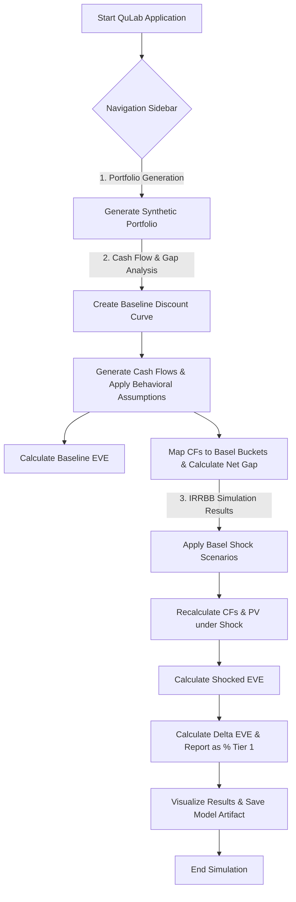

id: 6891027254d65e6ea0e3f008_documentation
summary: Lab 5.1 IRRBB Models - Development Documentation
feedback link: https://docs.google.com/forms/d/e/1FAIpQLSfWkOK-in_bMMoHSZfcIvAeO58PAH9wrDqcxnJABHaxiDqhSA/viewform?usp=sf_link
environments: Web
status: Published
# Comprehensive Interest Rate Risk in the Banking Book (IRRBB) Engine with Streamlit

## 1. Introduction to IRRBB and Application Overview
Duration: 00:05:00

Interest Rate Risk in the Banking Book (IRRBB) is a critical risk banks face, stemming from the mismatch between the repricing of assets and liabilities and off-balance sheet items. Fluctuations in interest rates can significantly impact a bank's earnings and economic value. The Basel Committee on Banking Supervision (BCBS) provides a framework for managing and measuring IRRBB, focusing on metrics like Economic Value of Equity (EVE) and Net Interest Income (NII).

This codelab will guide you through building and understanding a sophisticated IRRBB engine using Python and Streamlit. The application implements a **full-revaluation framework** to analyze the impact of interest rate changes on a bank's Economic Value of Equity (EVE).

### Importance and Context

For banks, managing IRRBB is paramount for financial stability and regulatory compliance. Unexpected interest rate movements can erode capital, leading to financial distress. This application demonstrates a robust methodology to quantify this risk, aligning with common industry practices and regulatory expectations (e.g., Basel III). By understanding the underlying mechanics, developers can build more resilient financial systems.

### Economic Value of Equity (EVE)

The core concept in this application is the **Economic Value of Equity (EVE)**. EVE represents the present value of all banking book assets minus the present value of all banking book liabilities and off-balance sheet items. It provides a long-term measure of risk, reflecting the impact of interest rate changes on the bank's underlying economic value.

The Present Value (PV) of a series of cash flows is the sum of the present values of each individual cash flow. For a single cash flow $CF_t$ received at time $t$, discounted at a rate $r_t$:
$$ PV(CF_t) = \frac{CF_t}{(1 + r_t)^{t}} $$
For a series of cash flows $CF_1, CF_2, \ldots, CF_M$ occurring at times $t_1, t_2, \ldots, t_M$:
$$ PV = \sum_{k=1}^{M} \frac{CF_k}{(1 + r_{t_k})^{t_k}} $$
For EVE calculation, the cash flows will be discounted using a risk-free yield curve plus an appropriate liquidity spread; commercial margins are excluded.

EVE is defined as:
$$ EVE_{\text{baseline}} = \sum_{i=1}^{N_A} PV(CF_{A,i}) - \sum_{j=1}^{N_L} PV(CF_{L,j}) $$

### Delta EVE ($\Delta EVE$)

$\Delta EVE$ measures the change in a bank's EVE due to an interest rate shock:
$$ \Delta EVE = EVE_{\text{shocked}} - EVE_{\text{baseline}} $$

$\Delta EVE$ will be reported as a percentage of Tier 1 capital, allowing for a standardized interpretation of the risk signal:
$$ \Delta EVE (\% \text{ Tier 1 Capital}) = \frac{\Delta EVE}{\text{Tier 1 Capital}} \times 100\% $$

### Learning Goals

Upon completing this codelab, you will be able to:
*   Assemble a banking-book positions dataset that captures interest-sensitive assets, liabilities, and (optionally) simple hedges.
*   Generate synthetic cash-flow data for those positions, respecting product features and behavioural assumptions.
*   Build a full-revaluation IRRBB engine that computes baseline present values, allocates cash flows into regulatory time buckets, and estimates $\Delta EVE$ under the Basel six-scenario shock set.
*   Report $\Delta EVE$ as a percentage of Tier 1 capital and interpret the risk signal of each scenario.

### Application Overview

The application is structured into three main pages, accessible via the sidebar navigation:
1.  **Portfolio Generation**: Create a synthetic portfolio of loans, deposits, and bonds.
2.  **Cash Flow & Gap Analysis**: Generate cash flows for the portfolio, apply behavioral assumptions, construct a baseline discount curve, calculate baseline EVE, and perform Net Gap analysis.
3.  **IRRBB Simulation Results**: Apply Basel interest rate shock scenarios, re-calculate EVE under shock, determine $\Delta EVE$, and visualize the results.

The core logic is modularized into `irrbb_core_functions.py` for reusability and clarity.



## 2. Setting Up the Environment and Understanding Global Parameters
Duration: 00:05:00

To get started, ensure you have Python installed (preferably Python 3.8+). You'll also need to install the required libraries.

<aside class="positive">
It's recommended to use a virtual environment to manage your dependencies.
</aside>

1.  **Save the code**: Create a folder named `QuLab_IRRBB`. Inside, create `app.py` and a subfolder `application_pages`. Place `irrbb_core_functions.py`, `page1.py`, `page2.py`, and `page3.py` inside `application_pages`.
2.  **Install dependencies**:
    Create a `requirements.txt` file with the following content:
    ```
    streamlit
    pandas
    numpy
    python-dateutil
    scipy
    plotly
    ```
    Then, install them using pip:
    ```bash
    pip install -r requirements.txt
    ```
3.  **Run the application**:
    Navigate to the `QuLab_IRRBB` directory in your terminal and run:
    ```bash
    streamlit run app.py
    ```
    This will open the Streamlit application in your web browser.

### Global Constants and Utility Functions

The `app.py` file serves as the main entry point and defines several global constants and utility functions used across the application. These constants ensure consistency in financial definitions and shock scenarios.

```python
# app.py
import streamlit as st
import pandas as pd
import numpy as np
from datetime import datetime, timedelta, date
from dateutil.relativedelta import relativedelta
import uuid
from scipy.interpolate import interp1d
import plotly.express as px
import plotly.graph_objects as go
import pickle
import random

st.set_page_config(page_title="QuLab", layout="wide")
st.sidebar.image("https://www.quantuniversity.com/assets/img/logo5.jpg")
st.sidebar.divider()
st.title("QuLab")
st.divider()

# ... (markdown introduction) ...

# Global Constants/Parameters
valuation_date = date(2024, 1, 1) # Set a fixed valuation date
# Define standard Basel buckets for tenors (in months)
standard_tenors_months = [
    1, 3, 6, 12, 24, 36, 60, 120, 180, 240, 360 # Corresponding to 1M, 3M, 6M, 1Y, 2Y, 3Y, 5Y, 10Y, 15Y, 20Y, 30Y
]

# Market rates for baseline discount curve (fixed for this application)
market_rates_data = {
    '1M': 0.02, '3M': 0.022, '6M': 0.025, '1Y': 0.028, '2Y': 0.03, '3Y': 0.032,
    '5Y': 0.035, '7Y': 0.037, '10Y': 0.04, '15Y': 0.042, '20Y': 0.043, '30Y': 0.044
}

# Basel bucket definitions for gap analysis
basel_bucket_definitions_list = [
    (0, 1, 'M'), (1, 3, 'M'), (3, 6, 'M'), (6, 12, 'M'),
    (1, 2, 'Y'), (2, 3, 'Y'), (3, 5, 'Y'), (5, 10, 'Y'), (10, float('inf'), 'Y')
]

# Shock scenarios definitions (fixed for this application)
shock_scenarios = {
    'Parallel Up': {'short': 200, 'long': 200},  # +200 bps across the curve
    'Parallel Down': {'short': -200, 'long': -200},  # -200 bps across the curve
    'Steepener': {'short': -100, 'long': 100},  # Short rates down 100 bps, long rates up 100 bps
    'Flattener': {'short': 100, 'long': -100},  # Short rates up 100 bps, long rates down 100 bps
    'Short-Up': {'short': 200, 'long': 0},  # Short rates up 200 bps, long unchanged
    'Short-Down': {'short': -200, 'long': 0}  # Short rates down 200 bps, long unchanged
}

# Utility Functions
def save_data_to_csv(dataframe, filename):
    dataframe.to_csv(filename, index=False)

def save_data_to_parquet(dataframe, filename):
    dataframe.to_parquet(filename, index=False)

def save_model_artifact(model_object, filename):
    with open(filename, 'wb') as f:
        pickle.dump(model_object, f)

def plot_delta_eve_bar_chart(delta_eve_percentages):
    # ... (Plotly chart definition) ...
    st.plotly_chart(fig, use_container_width=True)

def convert_tenor_curve_to_date_curve(tenor_curve_df, valuation_date_for_conversion):
    # ... (conversion logic) ...
    return pd.DataFrame(date_curve_data)

# Your code starts here
page = st.sidebar.selectbox(label="Navigation", options=["Portfolio Generation", "Cash Flow & Gap Analysis", "IRRBB Simulation Results"])

if page == "Portfolio Generation":
    from application_pages.page1 import run_page1
    run_page1()
elif page == "Cash Flow & Gap Analysis":
    from application_pages.page2 import run_page2
    run_page2()
elif page == "IRRBB Simulation Results":
    from application_pages.page3 import run_page3
    run_page3()
```

*   **`valuation_date`**: The reference date for all present value calculations and cash flow projections.
*   **`standard_tenors_months`**: Defines the maturities (in months) for which market rates are known or derived. These are also used for interpolating the discount curve.
*   **`market_rates_data`**: A dictionary representing the initial market yield curve for various tenors.
*   **`basel_bucket_definitions_list`**: Specifies the time buckets (e.g., 0-1M, 1-3M, 1-2Y) used for regulatory gap analysis.
*   **`shock_scenarios`**: Defines the six standardized Basel interest rate shock scenarios, including the magnitude of the shock (in basis points) for short and long ends of the curve.
*   **Utility Functions**: Helper functions for data persistence (`save_data_to_csv`, `save_data_to_parquet`, `save_model_artifact`), plotting (`plot_delta_eve_bar_chart`), and date conversions (`convert_tenor_curve_to_date_curve`).

## 3. Generating a Synthetic Banking Book Portfolio
Duration: 00:10:00

The first step in any IRRBB analysis is to define the banking book. Since actual banking data is sensitive and complex, this application starts by generating a synthetic portfolio. This allows for a controlled environment to demonstrate the IRRBB engine's capabilities.

Navigate to the "**Portfolio Generation**" page in the sidebar.

### User Inputs

On this page, you can configure the following parameters:
*   **Number of Instruments**: The total count of financial instruments (loans, deposits, bonds) to generate.
*   **Tier 1 Capital (TWD)**: Represents the bank's core capital, crucial for reporting $\Delta EVE$ as a percentage.
*   **Portfolio Start Date**: The effective start date for the portfolio.
*   **Portfolio End Date**: The latest possible maturity date for any instrument.

These parameters are stored in Streamlit's `session_state` to be accessible across different pages.

### `generate_synthetic_portfolio` Function

The core logic for creating the portfolio resides in the `generate_synthetic_portfolio` function within `application_pages/irrbb_core_functions.py`.

```python
# application_pages/irrbb_core_functions.py
@st.cache_data(show_spinner="Generating synthetic portfolio...")
def generate_synthetic_portfolio(num_instruments, tier1_capital, start_date, end_date):
    """
    Generates a synthetic banking book portfolio.
    """
    data = []
    instrument_categories = ['Loan', 'Deposit', 'Bond']
    rate_types = ['Fixed', 'Floating']
    currencies = ['TWD']
    payment_frequencies = ['Monthly', 'Quarterly', 'Semi-Annually', 'Annually']
    embedded_options = [None, 'Call', 'Put']
    indexes = ['TAIBOR 1M', 'TAIBOR 3M', 'TAIBOR 6M', None]
    
    end_date_dt = datetime.combine(end_date, datetime.min.time())
    start_date_dt = datetime.combine(start_date, datetime.min.time())

    for _ in range(num_instruments):
        instrument_id = str(uuid.uuid4())
        category = random.choice(instrument_categories)
        
        # Assign balance, NMD flag, and initial rate type based on category
        if category == 'Loan':
            balance = random.uniform(1_000_000, 100_000_000)
            is_core_NMD = False
            behavioral_flag = None
            rate_type = random.choices(['Fixed', 'Floating'], weights=[0.6, 0.4], k=1)[0] # More fixed loans
        elif category == 'Deposit':
            balance = random.uniform(500_000, 50_000_000)
            is_core_NMD = random.choices([True, False], weights=[0.3, 0.7], k=1)[0] # 30% core NMD
            behavioral_flag = 'NMD' if is_core_NMD else None
            rate_type = random.choices(['Fixed', 'Floating'], weights=[0.2, 0.8], k=1)[0] # More floating deposits
        else: # Bond
            balance = random.uniform(5_000_000, 200_000_000)
            is_core_NMD = False
            behavioral_flag = None
            rate_type = random.choices(['Fixed', 'Floating'], weights=[0.8, 0.2], k=1)[0] # More fixed bonds
        
        # Assign index and spread for floating rates
        index = random.choice(indexes) if rate_type == 'Floating' else None
        spread_bps = random.randint(5, 50) if rate_type == 'Floating' else 0
        current_rate = random.uniform(0.01, 0.05)
        
        # Determine maturity date
        maturity_date = start_date_dt + relativedelta(months=random.randint(1, 360))
        if maturity_date > end_date_dt:
            maturity_date = end_date_dt

        # Determine next repricing date for floating instruments
        next_repricing_date = None
        if rate_type == 'Floating':
            reprice_interval_months = random.choice([1, 3, 6, 12])
            next_repricing_candidate = start_date_dt + relativedelta(months=random.randint(0, reprice_interval_months-1))
            
            if next_repricing_candidate < valuation_date: # Ensure repricing date is in future
                while next_repricing_candidate < valuation_date:
                    next_repricing_candidate += relativedelta(months=reprice_interval_months)
            
            if next_repricing_candidate <= maturity_date:
                next_repricing_date = next_repricing_candidate

        # Other attributes
        payment_freq = random.choice(payment_frequencies)
        currency = random.choice(currencies)
        embedded_option = random.choice(embedded_options) if random.random() < 0.1 else None # 10% chance of option

        data.append({
            'instrument_id': instrument_id, 'category': category, 'balance': balance,
            'rate_type': rate_type, 'index': index, 'spread_bps': spread_bps,
            'current_rate': current_rate, 'payment_freq': payment_freq,
            'maturity_date': maturity_date, 'next_repricing_date': next_repricing_date,
            'currency': currency, 'embedded_option': embedded_option,
            'is_core_NMD': is_core_NMD, 'behavioral_flag': behavioral_flag
        })
    
    df = pd.DataFrame(data)
    # Ensure date columns are in datetime format
    for col in ['maturity_date', 'next_repricing_date']:
        if col in df.columns:
            df[col] = df[col].apply(lambda x: pd.to_datetime(x) if x is not None else None)
    return df
```

The function generates a DataFrame where each row represents an instrument with attributes like:
*   `instrument_id`: Unique identifier.
*   `category`: Loan, Deposit, or Bond.
*   `balance`: Notional balance.
*   `rate_type`: Fixed or Floating.
*   `index`: For floating rates (e.g., TAIBOR 1M).
*   `spread_bps`: Spread over the index for floating rates.
*   `current_rate`: Initial interest rate.
*   `payment_freq`: Monthly, Quarterly, etc.
*   `maturity_date`: Contractual end date.
*   `next_repricing_date`: For floating rates, when the rate next adjusts.
*   `is_core_NMD`: Boolean, indicates if it's a non-maturity deposit with a stable behavioral portion.
*   `behavioral_flag`: 'NMD' or 'Mortgage_Prepayment' (implicitly via 'Loan' category for prepayment).

The `@st.cache_data` decorator caches the function's output, preventing re-execution unless inputs change, making the application much faster.

Once generated, the portfolio's first 5 rows, total instruments, and total balance are displayed. You can also download the portfolio as a CSV.

## 4. Cash Flow Projection and Baseline Valuation
Duration: 00:15:00

With the portfolio generated, the next crucial step is to project its cash flows and determine the baseline Economic Value of Equity (EVE). This involves creating a discount curve and applying behavioral assumptions.

Navigate to the "**Cash Flow & Gap Analysis**" page.

### Model Parameters

Before running the analysis, configure the following parameters:
*   **Liquidity Spread (bps)**: An additional spread (in basis points) applied to the risk-free rate to reflect liquidity premiums in the discount curve.
*   **Mortgage Prepayment Rate (Annual)**: The annual rate at which mortgages (Loans) are assumed to prepay. This reduces future principal cash flows.
*   **NMD Beta**: For Non-Maturity Deposits (NMDs), this is the proportion considered "stable" and assigned a behavioral maturity. The rest is treated as callable on demand.
*   **NMD Behavioral Maturity (Years)**: The assumed average maturity for the stable portion of NMDs.
*   **Behavioral Shock Adjustment Factor**: Used later to adjust behavioral assumptions under shock scenarios.

### Creating the Baseline Discount Curve

The `create_baseline_discount_curve` function generates a discount curve based on the global `market_rates_data` and the specified `liquidity_spread_bps`.

```python
# application_pages/irrbb_core_functions.py
@st.cache_data(show_spinner="Creating baseline discount curve...")
def create_baseline_discount_curve(valuation_date_param, market_rates, tenors_in_months, liquidity_spread_bps):
    """
    Creates a baseline discount curve by interpolating market rates and adding a liquidity spread.
    """
    liquidity_spread_decimal = liquidity_spread_bps / 10000.0
    
    # Parse market rates tenors to months and sort
    # ...
    
    # Linear interpolation of market rates
    interp_func = interp1d(market_tenors_months, market_rates_values, kind='linear', fill_value='extrapolate')
    
    interpolated_rates = interp_func(tenors_in_months)
    final_rates = interpolated_rates + liquidity_spread_decimal # Add liquidity spread
    
    result_df = pd.DataFrame({
        'Tenor_Months': tenors_in_months,
        'Discount_Rate': final_rates
    })
    return result_df
```
The market rates are interpolated linearly to cover all `standard_tenors_months`, and then the liquidity spread is added to each rate. The `convert_tenor_curve_to_date_curve` utility function then converts this tenor-based curve into a date-based curve for easier cash flow discounting.

### Cash Flow Projection

The `generate_all_cash_flows` function orchestrates the cash flow generation for the entire portfolio. It iterates through each instrument and calls `calculate_cashflows_for_instrument` to project contractual cash flows.

```python
# application_pages/irrbb_core_functions.py
def calculate_cashflows_for_instrument(instrument_data, discount_curve_df, valuation_date_param):
    """
    Calculates projected cash flows for a single instrument.
    Assumes discount_curve_df has 'date' and 'rate' columns.
    """
    cash_flows = []
    # ... extract instrument data ...

    if instrument_data['is_core_NMD']: # Handled separately by behavioral assumptions
        return pd.DataFrame([])

    freq_map = {'Monthly': 1, 'Quarterly': 3, 'Semi-Annually': 6, 'Annually': 12}
    payment_interval_months = freq_map.get(payment_freq, 0)

    # Determine payment dates
    # ... logic for generating payment dates based on frequency and maturity ...

    for payment_date in payment_dates:
        # Calculate interest payments
        if is_interest_date:
            interest_amount = balance * (current_rate + (spread_bps / 10000.0 if rate_type == 'Floating' else 0.0)) * (payment_interval_months / 12.0)
            # Add interest cash flow to list, sign based on category (loan vs deposit)

        # Calculate principal payment at maturity
        if payment_date == maturity_date:
            # Add principal cash flow to list, sign based on category

        # Add repricing event marker for floating rates (for later repricing under shock)
        if rate_type == 'Floating' and next_repricing_date is not None and payment_date >= next_repricing_date:
            # Add repricing cash flow with amount 0.0
    return pd.DataFrame(cash_flows)
```
This function generates both interest and principal cash flows, marking repricing events for floating-rate instruments.

### Behavioral Assumptions

After contractual cash flows are generated, `apply_behavioral_assumptions` modifies them to reflect real-world behaviors.

```python
# application_pages/irrbb_core_functions.py
def apply_behavioral_assumptions(cashflow_df_input, behavioral_flag, prepayment_rate_annual, nmd_beta, nmd_behavioral_maturity_years, valuation_date_param):
    """
    Applies behavioral assumptions (prepayment, NMD) to cash flows.
    """
    cashflow_df = cashflow_df_input.copy()
    if cashflow_df.empty: return pd.DataFrame([])

    # Mortgage Prepayment Logic
    if behavioral_flag == 'Mortgage_Prepayment' and 'Loan' in cashflow_df['category'].unique():
        # Adjust principal CFs based on prepayment_rate_annual
        # New principal = Original principal * (1 - (1 - exp(-rate * time_to_cf_years)))
        # This assumes a constant prepayment rate
        pass

    # Non-Maturity Deposit (NMD) Logic
    if behavioral_flag == 'NMD' and 'Deposit' in cashflow_df['category'].unique():
        # Remove original CFs for NMD and replace with a single CF at behavioral maturity
        initial_balance = cashflow_df['original_balance'].iloc[0]
        stable_portion_amount = initial_balance * (1 - nmd_beta)
        # Create a new cash flow for the stable portion at NMD behavioral maturity
        pass
        
    return cashflow_df.sort_values(by='cashflow_date').reset_index(drop=True)
```
*   **Mortgage Prepayment**: For loans flagged with `Mortgage_Prepayment`, principal cash flows are reduced based on the `mortgage_prepayment_rate_annual`. This assumes that some borrowers will repay their loans earlier than contractually obliged.
*   **Non-Maturity Deposits (NMDs)**: For deposits flagged as `is_core_NMD`, the original contractual cash flows (which typically imply immediate callable nature) are removed. Instead, a portion (`1 - NMD Beta`) of the initial balance is treated as "stable" and assigned a single principal cash flow at the `NMD Behavioral Maturity (Years)`. This recognizes that a portion of NMDs behaves like longer-term funding.

### Calculating Baseline Present Value and EVE

Finally, `calculate_present_value_for_cashflows` discounts all projected cash flows back to the `valuation_date` using the `baseline_date_curve_df`.

```python
# application_pages/irrbb_core_functions.py
@st.cache_data(show_spinner="Calculating Present Values...")
def calculate_present_value_for_cashflows(cashflow_df, discount_date_curve_df, valuation_date_param):
    """
    Calculates the present value of cash flows using the provided discount curve.
    """
    if cashflow_df.empty or discount_date_curve_df.empty:
        return 0.0, 0.0

    # Ensure date columns are datetime and interpolate discount rates
    # ... (date handling and interpolation logic) ...

    total_pv_assets = 0.0
    total_pv_liabilities = 0.0

    for index, row in cashflow_df.iterrows():
        cf_date = pd.to_datetime(row['cashflow_date'])
        cf_amount = row['amount']
        category = row['category']
        
        days_diff = (cf_date - valuation_date_param).days
        if days_diff < 0: continue # Only future cash flows

        # Get discount rate for cf_date from interpolated curve
        discount_rate_at_cf_date = interp_func(days_diff).item()
        
        # Calculate discount factor
        if days_diff == 0:
            discount_factor = 1.0
        else:
            time_in_years = days_diff / 365.25
            discount_factor = 1 / ((1 + discount_rate_at_cf_date)**time_in_years)

        pv_cf = cf_amount * discount_factor

        if category in ['Loan', 'Bond']:
            total_pv_assets += pv_cf
        elif category in ['Deposit']:
            total_pv_liabilities += pv_cf

    return total_pv_assets, total_pv_liabilities
```
The `calculate_eve` function then simply computes $EVE = PV_{Assets} - PV_{Liabilities}$.

The page displays the generated baseline discount curve, a sample of the cash flows with assigned Basel buckets (explained next), and the calculated baseline EVE.

## 5. Interest Rate Risk Measurement: Net Gap Analysis
Duration: 00:10:00

Alongside EVE, **Net Gap Analysis** is a fundamental tool for understanding IRRBB. It quantifies the difference between interest-sensitive assets and liabilities maturing or repricing within specific time buckets. A positive gap indicates asset sensitivity (more assets repricing/maturing than liabilities), while a negative gap indicates liability sensitivity.

This analysis is performed on the "Cash Flow & Gap Analysis" page.

### Mapping Cash Flows to Basel Buckets

The `map_cashflows_to_basel_buckets` function allocates each projected cash flow into predefined regulatory time buckets based on its time to the valuation date.

```python
# application_pages/irrbb_core_functions.py
@st.cache_data(show_spinner="Mapping cash flows to Basel buckets...")
def map_cashflows_to_basel_buckets(cashflow_df, valuation_date_param, basel_bucket_definitions):
    """
    Maps cash flows to defined Basel regulatory time buckets.
    """
    if cashflow_df.empty: return pd.DataFrame()

    bucketed_cfs_list = []

    for index, row in cashflow_df.iterrows():
        cf_date = row['cashflow_date']
        # Calculate time_to_cf_total_months from valuation_date_param to cf_date
        # ...
        
        bucket_label = 'Unbucketed'
        for start_val, end_val, unit in basel_bucket_definitions:
            lower_bound_months = start_val * 12 if unit == 'Y' else start_val
            upper_bound_months = end_val * 12 if unit == 'Y' else end_val
            
            if end_val == float('inf'): # Handle the 'Over' bucket
                if time_to_cf_total_months >= lower_bound_months:
                    bucket_label = f"{start_val}{unit}-Over"
                    break
            elif lower_bound_months <= time_to_cf_total_months < upper_bound_months:
                # Assign bucket label (e.g., '1Y-2Y')
                bucket_label = f"{start_val}{unit}-{end_val}{unit}"
                break

        bucketed_cfs_list.append({
            # ... cash flow details ...
            'basel_bucket': bucket_label,
            'time_to_cf_months': time_to_cf_total_months
        })

    return pd.DataFrame(bucketed_cfs_list)
```
The `basel_bucket_definitions_list` global constant (from `app.py`) defines these buckets:
```python
basel_bucket_definitions_list = [
    (0, 1, 'M'), (1, 3, 'M'), (3, 6, 'M'), (6, 12, 'M'), # Months
    (1, 2, 'Y'), (2, 3, 'Y'), (3, 5, 'Y'), (5, 10, 'Y'), (10, float('inf'), 'Y') # Years
]
```

The net gap for each time bucket represents the difference between total cash inflows (from assets) and total cash outflows (from liabilities and derivatives) within that bucket:
$$ Net\ Gap_{\text{bucket } k} = \sum_{\text{assets in bucket } k} CF_{\text{in}} - \sum_{\text{liabilities in bucket } k} CF_{\text{out}} $$

### Calculating the Net Gap

The `calculate_net_gap` function aggregates the bucketted cash flows to produce the Net Gap table.

```python
# application_pages/irrbb_core_functions.py
@st.cache_data(show_spinner="Calculating Net Gap...")
def calculate_net_gap(bucketed_cashflow_df):
    """
    Calculates the net gap for each Basel bucket.
    """
    if bucketed_cashflow_df.empty: return pd.DataFrame()

    ordered_buckets = [
        '0M-1M', '1M-3M', '3M-6M', '6M-12M', '1Y-2Y', '2Y-3Y', '3Y-5Y', '5Y-10Y', '10Y-Over'
    ]
    
    asset_cfs = bucketed_cashflow_df[bucketed_cashflow_df['category'].isin(['Loan', 'Bond'])]
    liability_cfs = bucketed_cashflow_df[bucketed_cashflow_df['category'].isin(['Deposit'])]

    # Group by bucket and sum amounts for assets and liabilities separately
    asset_sums = asset_cfs.groupby('basel_bucket')['amount'].sum().reindex(ordered_buckets).fillna(0)
    liability_sums = liability_cfs.groupby('basel_bucket')['amount'].sum().reindex(ordered_buckets).fillna(0)

    # Net gap is assets + liabilities (liabilities have negative amounts)
    net_gap = asset_sums + liability_sums

    gap_table_df = pd.DataFrame({
        'Basel Bucket': net_gap.index,
        'Assets CF': asset_sums.values,
        'Liabilities CF': liability_sums.values,
        'Net Gap': net_gap.values
    })
    
    # Ensure correct bucket order for display
    gap_table_df['Basel Bucket'] = pd.Categorical(gap_table_df['Basel Bucket'], categories=ordered_buckets, ordered=True)
    gap_table_df = gap_table_df.sort_values('Basel Bucket').fillna(0)

    return gap_table_df
```
The output is a table showing total cash inflows from assets, total cash outflows from liabilities, and the net gap for each bucket. A positive net gap implies that assets reprice or mature before liabilities, exposing the bank to falling rates. Conversely, a negative net gap implies liability sensitivity, making the bank vulnerable to rising rates.

## 6. Basel Interest Rate Shock Scenarios and $\Delta EVE$ Simulation
Duration: 00:20:00

This is the core of the IRRBB engine, where the impact of various interest rate scenarios on the bank's EVE is quantified. This section is available on the "**IRRBB Simulation Results**" page.

### Basel Interest Rate Shock Scenarios

The Basel framework prescribes six standardized scenarios to assess IRRBB. These scenarios simulate different shapes and magnitudes of yield curve shifts. The `shock_scenarios` global constant defines these:

```python
# app.py
shock_scenarios = {
    'Parallel Up': {'short': 200, 'long': 200},  # +200 bps across the curve
    'Parallel Down': {'short': -200, 'long': -200},  # -200 bps across the curve
    'Steepener': {'short': -100, 'long': 100},  # Short rates down 100 bps, long rates up 100 bps
    'Flattener': {'short': 100, 'long': -100},  # Short rates up 100 bps, long rates down 100 bps
    'Short-Up': {'short': 200, 'long': 0},  # Short rates up 200 bps, long unchanged
    'Short-Down': {'short': -200, 'long': 0}  # Short rates down 200 bps, long unchanged
}
```

### Generating Shocked Discount Curves

For each scenario, a new discount curve is generated using `generate_basel_shocked_curve`.

```python
# application_pages/irrbb_core_functions.py
@st.cache_data(show_spinner="Generating Basel shocked curve...")
def generate_basel_shocked_curve(baseline_curve, scenario_type, shock_magnitude_bps_short, shock_magnitude_bps_long):
    """
    Generates a shocked discount curve based on Basel scenarios.
    """
    shocked_curve = baseline_curve.copy()
    
    shock_short_decimal = shock_magnitude_bps_short / 10000.0
    shock_long_decimal = shock_magnitude_bps_long / 10000.0

    if shock_magnitude_bps_short == shock_magnitude_bps_long: # Parallel shift
        shocked_curve['Discount_Rate'] = shocked_curve['Discount_Rate'] + shock_short_decimal
    else: # Twist (Steepener/Flattener) or Short-end shock
        short_tenor_point = standard_tenors_months[0]
        long_tenor_point = standard_tenors_months[-1]
        
        shock_tenors = [short_tenor_point, long_tenor_point]
        shock_values = [shock_short_decimal, shock_long_decimal]
        
        # Interpolate shock amounts across tenors
        shock_interp_func = interp1d(shock_tenors, shock_values, kind='linear', fill_value='extrapolate')
        shock_amounts = shock_interp_func(shocked_curve['Tenor_Months'])
        
        shocked_curve['Discount_Rate'] = shocked_curve['Discount_Rate'] + shock_amounts
    
    return shocked_curve
```
This function applies the specified shock (constant for parallel shifts, or interpolated for twists/short-end shocks) to the baseline discount rates. The resulting tenor curve is then converted to a date curve using `convert_tenor_curve_to_date_curve`.

### Repricing and Re-evaluating Under Shock

The `recalculate_cashflows_and_pv_for_scenario` function is the core orchestration for each shock scenario.

```python
# application_pages/irrbb_core_functions.py
@st.cache_data(show_spinner="Recalculating cash flows and PV for scenario...")
def recalculate_cashflows_and_pv_for_scenario(portfolio_df, shocked_date_curve, valuation_date_param, scenario_type,
                                            baseline_date_curve_df,
                                            baseline_prepayment_rate_annual, behavioral_shock_adjustment_factor,
                                            nmd_beta_val, nmd_behavioral_maturity_years_val):
    """
    Orchestrates the recalculation of cash flows and present values under a given shock scenario.
    """
    scenario_cash_flows_list = []

    # Adjust behavioral assumptions (e.g., prepayment) based on shock type
    adjusted_prepayment_rate_for_scenario = adjust_behavioral_assumptions_for_shock(
        pd.DataFrame([]), scenario_type, baseline_prepayment_rate_annual, behavioral_shock_adjustment_factor
    )

    for index, row in portfolio_df.iterrows():
        # Step 1: Generate initial contractual CFs (re-using baseline logic)
        if row['is_core_NMD']:
            initial_instrument_cash_flows = pd.DataFrame([{... NMD balance ...}])
        else:
            initial_instrument_cash_flows = calculate_cashflows_for_instrument(row, baseline_date_curve_df, valuation_date_param)

        # Step 2: Reprice floating rate cash flows using the shocked curve
        repriced_instrument_cash_flows = reprice_floating_instrument_cashflows_under_shock(
            initial_instrument_cash_flows, row, shocked_date_curve
        )

        # Step 3: Apply behavioral assumptions (with potentially adjusted parameters)
        behaviorally_adjusted_cash_flows = apply_behavioral_assumptions(
            repriced_instrument_cash_flows,
            row['behavioral_flag'],
            adjusted_prepayment_rate_for_scenario, # Use adjusted prepayment rate
            nmd_beta_val,
            nmd_behavioral_maturity_years_val,
            valuation_date_param
        )
        
        scenario_cash_flows_list.append(behaviorally_adjusted_cash_flows)
    
    # Consolidate all cash flows for the scenario
    all_scenario_cash_flows = pd.concat(scenario_cash_flows_list, ignore_index=True)
    all_scenario_cash_flows = all_scenario_cash_flows[all_scenario_cash_flows['cashflow_date'] > valuation_date_param]

    # Step 4: Calculate Present Value using the shocked curve
    pv_assets_shocked, pv_liabilities_shocked = calculate_present_value_for_cashflows(
        all_scenario_cash_flows, shocked_date_curve, valuation_date_param
    )
    
    return calculate_eve(pv_assets_shocked, pv_liabilities_shocked)
```

The process for each scenario is as follows:
1.  **Adjust Behavioral Assumptions**: `adjust_behavioral_assumptions_for_shock` modifies parameters like the prepayment rate. For example, in an "Up" rate scenario, prepayment rates might decrease (as refinancing becomes less attractive), and vice-versa for "Down" scenarios.
    ```python
    # application_pages/irrbb_core_functions.py
    def adjust_behavioral_assumptions_for_shock(cashflow_df, scenario_type, baseline_prepayment_rate, behavioral_shock_adjustment_factor):
        """
        Adjusts behavioral assumptions (e.g., prepayment rates) under shock scenarios.
        """
        if 'Up' in scenario_type or 'Steepener' in scenario_type: # Rates up
            shocked_prepayment_rate = baseline_prepayment_rate * (1 - behavioral_shock_adjustment_factor)
        elif 'Down' in scenario_type or 'Flattener' in scenario_type: # Rates down
            shocked_prepayment_rate = baseline_prepayment_rate * (1 + behavioral_shock_adjustment_factor)
        else: # Unchanged or other scenarios
            shocked_prepayment_rate = baseline_prepayment_rate
        return shocked_prepayment_rate
    ```
2.  **Reprice Floating Instruments**: `reprice_floating_instrument_cashflows_under_shock` adjusts the interest cash flows of floating-rate instruments based on the new shocked curve. This is crucial as floating rates are sensitive to market rate changes.
    ```python
    # application_pages/irrbb_core_functions.py
    def reprice_floating_instrument_cashflows_under_shock(instrument_cashflow_df, instrument_data, shocked_date_curve):
        """
        Reprices floating-rate instrument cash flows based on the shocked curve.
        """
        reprice_df = instrument_cashflow_df.copy()
        if reprice_df.empty: return pd.DataFrame([])

        if instrument_data['rate_type'] == 'Floating':
            spread_bps = instrument_data['spread_bps']
            # Interpolate shocked rates for cash flow dates
            # ...
            for idx in interest_cfs_indices:
                # Get new base rate from shocked curve, calculate new effective rate
                # Recalculate interest amount based on new effective rate and original balance
                pass
        return reprice_df
    ```
3.  **Recalculate Cash Flows and PV**: All cash flows (original fixed, repriced floating, and behaviorally adjusted) are then re-discounted using the new shocked discount curve to calculate the `shocked_eve`.

### $\Delta EVE$ Calculation and Reporting

After computing the `shocked_eve` for each scenario, `calculate_delta_eve` simply subtracts the `baseline_eve`.

```python
# application_pages/irrbb_core_functions.py
def calculate_delta_eve(baseline_eve, shocked_eve):
    """Calculates Delta EVE."""
    return shocked_eve - baseline_eve

def report_delta_eve_as_percentage_of_tier1(delta_eve_results, tier1_capital):
    """
    Generates a DataFrame for Delta EVE report as percentage of Tier 1 Capital.
    """
    report_data = []
    for scenario, delta_eve_val in delta_eve_results.items():
        delta_eve_percent = (delta_eve_val / tier1_capital) * 100
        report_data.append({
            'Scenario': scenario,
            'Delta EVE (TWD)': delta_eve_val,
            'Delta EVE (% Tier 1 Capital)': delta_eve_percent
        })
    return pd.DataFrame(report_data)
```
The results are then presented as a percentage of Tier 1 Capital, a standardized metric for comparing risk across different banks. A bar chart visually summarizes the $\Delta EVE$ for each scenario.

```mermaid
graph TD
    A[Run IRRBB Simulation] --> B{Retrieve Baseline EVE, Portfolio, Parameters};
    B --> C{For Each Basel Shock Scenario};
    C --> D[Generate Shocked Tenor Curve];
    D --> E[Convert to Shocked Date Curve];
    E --> F[Adjust Behavioral Assumptions (e.g., Prepayment Rate)];
    F --> G[Generate Initial Contractual CFs for Portfolio (from Baseline)];
    G --> H[Reprice Floating Rate CFs using Shocked Date Curve];
    H --> I[Apply Behavioral Assumptions (with Adjusted Params)];
    I --> J[Consolidate All Scenario CFs];
    J --> K[Calculate PV of Assets & Liabilities using Shocked Date Curve];
    K --> L[Calculate Shocked EVE for Scenario];
    L --> M[Calculate Delta EVE = Shocked EVE - Baseline EVE];
    M --> N{All Scenarios Processed?};
    N -- No --> C;
    N -- Yes --> O[Compile Delta EVE Results];
    O --> P[Report Delta EVE as % of Tier 1 Capital];
    P --> Q[Plot Delta EVE Bar Chart];
    Q --> R[Save Model Artifact (Pickle)];
    R --> S[End Simulation];
```

The application also saves a pickled model artifact (`irrbb_gap_eve_model.pkl`) containing the key results and parameters, allowing for persistence and auditing of the simulation.

## 7. Deep Dive into Code Structure and Streamlit Best Practices
Duration: 00:05:00

The application's design incorporates several best practices for building robust and interactive Streamlit applications.

### Modularity

The code is organized into a main `app.py` and a subfolder `application_pages` containing page-specific logic and a core functions module:
*   `app.py`: Handles global constants, utility functions, and navigation. This keeps the main file clean and acts as the orchestrator.
*   `application_pages/page1.py`, `page2.py`, `page3.py`: Each file encapsulates the logic and Streamlit UI for a specific page. This makes the application easier to understand, maintain, and extend.
*   `application_pages/irrbb_core_functions.py`: Contains all the reusable computational functions. This separation of concerns improves code readability and testability. Functions are imported as needed, avoiding circular dependencies.

### Session State (`st.session_state`)

Streamlit applications re-run from top to bottom every time a user interacts with a widget. `st.session_state` is crucial for preserving data and state across these re-runs and between different pages.

For example, the generated `taiwan_portfolio_df` from Page 1 is stored in `st.session_state` so that Page 2 and Page 3 can access it without regenerating it.
```python
# application_pages/page1.py
st.session_state['taiwan_portfolio_df'] = generate_synthetic_portfolio(...)

# application_pages/page2.py
if 'taiwan_portfolio_df' not in st.session_state or st.session_state['taiwan_portfolio_df'].empty:
    st.warning("Please go to 'Portfolio Generation' page and generate a portfolio first.")
    return
```

### Caching (`st.cache_data`)

The `@st.cache_data` decorator is used extensively on computationally intensive functions (e.g., `generate_synthetic_portfolio`, `create_baseline_discount_curve`, `generate_all_cash_flows`, `calculate_present_value_for_cashflows`).

```python
# application_pages/irrbb_core_functions.py
@st.cache_data(show_spinner="Generating synthetic portfolio...")
def generate_synthetic_portfolio(...):
    # ... logic ...
