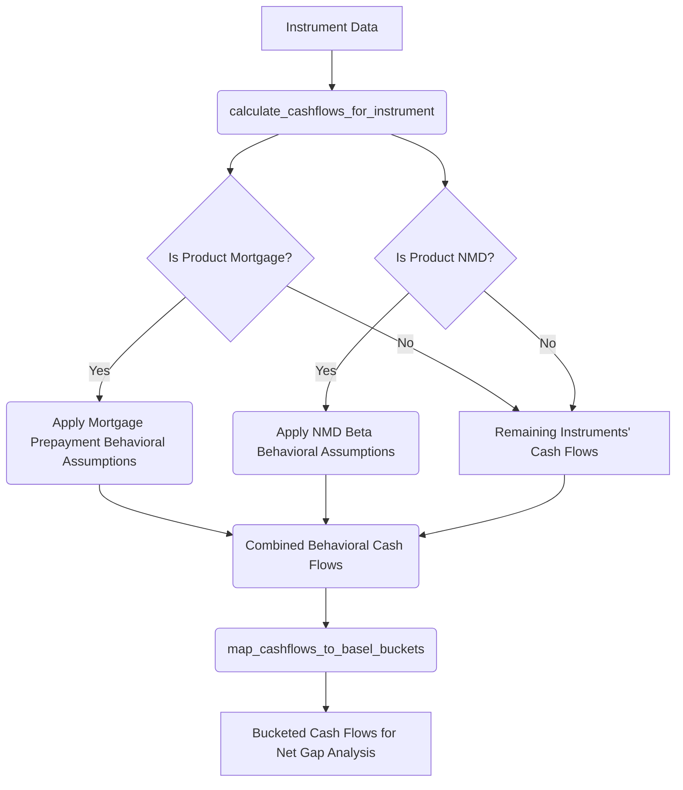
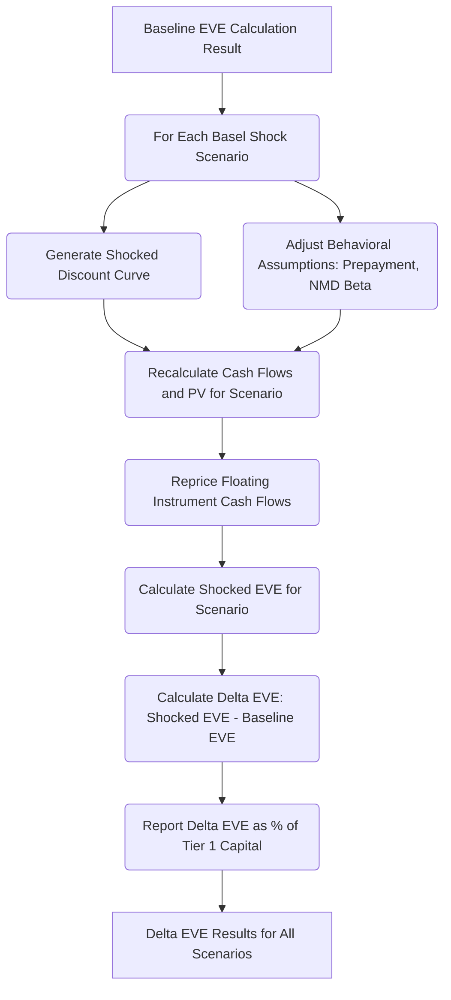

id: 6891027254d65e6ea0e3f008_documentation
summary: Lab 5.1 IRRBB Models - Development Documentation
feedback link: https://docs.google.com/forms/d/e/1FAIpQLSfWkOK-in_bMMoHSZfcIvAeO58PAH9wrDqcxnJABHaxiDqhSA/viewform?usp=sf_link
environments: Web
status: Published
# IRRBB Analysis with Streamlit: An Economic Value of Equity (EVE) Simulation

## 1. Introduction to Interest Rate Risk in the Banking Book (IRRBB) and EVE
Duration: 00:05:00

In this lab, we embark on an interactive journey to understand and simulate Interest Rate Risk in the Banking Book (IRRBB), with a specific focus on the Economic Value of Equity (EVE) framework. This codelab will guide you through the functionalities of a Streamlit application designed to help developers and finance professionals grasp the core concepts of IRRBB and its impact on a bank's economic value.

### What is IRRBB?

Interest Rate Risk in the Banking Book (IRRBB) refers to the potential adverse impact on a bank's capital and earnings due to changes in interest rates affecting positions held in its banking book. Unlike trading book positions, which are held for short-term profit from price movements, banking book positions (like loans, deposits, and bonds) are typically held to maturity or for liquidity management. Understanding and managing IRRBB is crucial for a bank's stability and profitability.

### The Economic Value of Equity (EVE) Framework

EVE is a cornerstone metric in IRRBB, providing a comprehensive, long-term view of a bank's exposure to interest rate risk. It represents the present value of the bank's expected future cash flows from all its assets, liabilities, and off-balance sheet items. EVE captures the sensitivity of the bank's intrinsic value to movements in interest rates.

The baseline EVE is mathematically defined as:

$$ EVE_{\text{baseline}} = \sum_{i=1}^{N_A} PV(CF_{A,i}) - \sum_{j=1}^{N_L} PV(CF_{L,j}) $$

Where:
- $N_A$ is the number of assets.
- $N_L$ is the number of liabilities.
- $PV(CF_{A,i})$ is the Present Value of cash flows from asset $i$.
- $PV(CF_{L,j})$ is the Present Value of cash flows from liability $j$.

The Present Value (PV) of a cash flow ($CF_t$) occurring at time $t$ is calculated by discounting it back to the valuation date using an appropriate discount rate ($r_t$):

$$ PV(CF_t) = \frac{CF_t}{(1 + r_t)^{t}} $$

For a series of cash flows, the total Present Value is the sum of the present values of all individual cash flows:

$$ PV = \sum_{k=1}^{M} \frac{CF_k}{(1 + r_{t_k})^{t_k}} $$

<aside class="positive">
<b>Important Note on Discounting:</b> The discount rate used is typically a risk-free rate (e.g., government bond yield curve) plus a liquidity spread. It explicitly excludes commercial margins, as these are considered part of the business's profitability and not directly related to interest rate risk on the balance sheet.
</aside>

### Change in Economic Value of Equity ($\Delta EVE$)

$\Delta EVE$ is the primary measure of EVE sensitivity. It quantifies the change in a bank's economic value when interest rates shift from a baseline scenario to a shocked scenario:

$$ \Delta EVE = EVE_{\text{shocked}} - EVE_{\text{baseline}} $$

For standardized reporting and cross-institution comparison, $\Delta EVE$ is often expressed as a percentage of Tier 1 Capital:

$$ \Delta EVE (\% \text{ Tier 1 Capital}) = \frac{\Delta EVE}{\text{Tier 1 Capital}} \times 100\% $$

### Key Concepts Explored in this Application:
-   **Cash Flow Generation and Behavioral Assumptions:** Accurately projecting cash flows for instruments like mortgages (with prepayment risk) and Non-Maturity Deposits (NMDs) with behavioral betas.
-   **Basel Six Interest Rate Shock Scenarios:** Applying regulatory-prescribed interest rate shifts (e.g., Parallel Up/Down, Steepener, Flattener) to the yield curve.
-   **Net Gap Analysis:** A complementary measure summarizing the difference between interest-sensitive assets and liabilities maturing or repricing within defined time buckets.

This application provides an interactive environment to generate synthetic banking portfolios, project cash flows under various behavioral assumptions, and assess the impact of interest rate shocks on a bank's economic value.

## 2. Setting Up the Development Environment
Duration: 00:10:00

Before running the application, you need to set up your Python environment and install the necessary libraries.

### Prerequisites

*   Python 3.8+
*   `pip` (Python package installer)

### Project Structure

The application code is organized into a main file and a directory for modularity:

```
.
├── app.py
└── application_pages/
    ├── __init__.py
    ├── page1.py
    ├── page2.py
    └── page3.py
```

*   `app.py`: The main Streamlit application entry point.
*   `application_pages/`: A directory containing separate Python files for each page of the Streamlit application. This enhances organization and maintainability.

### Installation Steps

1.  **Create a Virtual Environment (Recommended):**
    Virtual environments help manage dependencies for different projects.
    ```bash
    python -m venv irrbb_env
    ```

2.  **Activate the Virtual Environment:**
    *   **On Windows:**
        ```bash
        irrbb_env\Scripts\activate
        ```
    *   **On macOS/Linux:**
        ```bash
        source irrbb_env/bin/activate
        ```

3.  **Install Required Libraries:**
    The application uses `streamlit`, `pandas`, `numpy`, `scipy`, `plotly`, and `python-dateutil`. You can install them using pip:

    ```bash
    pip install streamlit pandas numpy scipy plotly python-dateutil
    ```

<aside class="positive">
It's good practice to create a `requirements.txt` file from your environment once all dependencies are installed, for easy sharing and reproduction:
<pre><code class="console">pip freeze > requirements.txt
</code></pre>
Then, others can install with:
<pre><code class="console">pip install -r requirements.txt
</code></pre>
</aside>

### Running the Application

Once all dependencies are installed, navigate to the directory containing `app.py` in your terminal and run the Streamlit command:

```bash
streamlit run app.py
```

This command will open a new tab in your web browser displaying the Streamlit application.

## 3. Exploring the Application Structure (`app.py` and Navigation)
Duration: 00:05:00

The `app.py` file serves as the central orchestrator for the Streamlit application. It handles global configurations and manages navigation between different sections (pages) of the application.

Let's examine the key components of `app.py`:

```python
# app.py
import streamlit as st
st.set_page_config(page_title="QuLab", layout="wide")
st.sidebar.image("https://www.quantuniversity.com/assets/img/logo5.jpg")
st.sidebar.divider()
st.title("QuLab")
st.divider()
st.markdown("""
# ... introductory markdown content ...
""")
# Your code starts here
page = st.sidebar.selectbox(label="Navigation", options=["Portfolio Generation", "IRRBB Analysis", "About"]) # Renamed for clarity
if page == "Portfolio Generation":
    from application_pages.page1 import run_page1
    run_page1()
elif page == "IRRBB Analysis":
    from application_pages.page2 import run_page2
    run_page2()
elif page == "About":
    from application_pages.page3 import run_page3
    run_page3()
# Your code ends
```

### Key Components:

1.  **Page Configuration (`st.set_page_config`)**:
    ```python
    st.set_page_config(page_title="QuLab", layout="wide")
    ```
    This function sets global Streamlit page configurations.
    -   `page_title="QuLab"`: Sets the title that appears in the browser tab.
    -   `layout="wide"`: Configures the page to use a wide layout, maximizing the display area for content, which is particularly useful for dashboards with charts and tables.

2.  **Sidebar Elements**:
    ```python
    st.sidebar.image("https://www.quantuniversity.com/assets/img/logo5.jpg")
    st.sidebar.divider()
    ```
    Streamlit provides a convenient sidebar (`st.sidebar`) for navigation, filters, or branding. Here, it displays an image logo and a horizontal divider for visual separation.

3.  **Main Page Title and Introduction**:
    ```python
    st.title("QuLab")
    st.divider()
    st.markdown(""" ... """)
    ```
    `st.title` sets the main title of the application. `st.divider` adds a horizontal line. The extensive `st.markdown` block provides an in-depth introduction to IRRBB, EVE, PV calculations, Delta EVE, Cash Flow Generation, Basel shock scenarios, and Net Gap Analysis. This ensures that the user has a proper context of the financial concepts before interacting with the simulation.

4.  **Navigation (`st.sidebar.selectbox`)**:
    ```python
    page = st.sidebar.selectbox(label="Navigation", options=["Portfolio Generation", "IRRBB Analysis", "About"])
    ```
    This is the core of the multi-page navigation. `st.sidebar.selectbox` creates a dropdown menu in the sidebar, allowing the user to select different sections of the application.

5.  **Conditional Page Loading**:
    ```python
    if page == "Portfolio Generation":
        from application_pages.page1 import run_page1
        run_page1()
    elif page == "IRRBB Analysis":
        from application_pages.page2 import run_page2
        run_page2()
    elif page == "About":
        from application_pages.page3 import run_page3
        run_page3()
    ```
    Based on the user's selection from the `selectbox`, `app.py` dynamically imports and calls the `run_pageX()` function from the corresponding module within the `application_pages` directory. This modular approach keeps the main `app.py` clean and separates concerns.

    *   `page1.py` (`Portfolio Generation`): Serves as an introductory page explaining the lab and how to use the "IRRBB Analysis" section.
    *   `page2.py` (`IRRBB Analysis`): Contains the core logic and interactive simulation for IRRBB and EVE.
    *   `page3.py` (`About`): Provides information about the application itself.

<aside class="positive">
This modular structure makes the application scalable and easier to manage, especially as more functionalities or pages are added. Each page can operate independently within its `run_page` function.
</aside>

## 4. Deep Dive into Portfolio Generation and Discount Curves (`page2.py` - Core Logic Part 1)
Duration: 00:15:00

The `application_pages/page2.py` file contains the robust engine for the IRRBB EVE simulation. This section focuses on the initial steps: setting up constants, generating a synthetic portfolio, and constructing the baseline discount curve.

### Constants and Configurations

The file begins by defining several constants that configure the simulation parameters:

```python
# application_pages/page2.py

# ... imports ...

#  Constants 
PRODUCT_TYPES = ["Mortgage", "Corporate Loan", "Government Bond", "Non-Maturity Deposit", "Fixed Deposit", "Interest Rate Swap"]
ASSET_LIAB_TYPE = {"Mortgage": "Asset", "Corporate Loan": "Asset", "Government Bond": "Asset",
                   "Non-Maturity Deposit": "Liability", "Fixed Deposit": "Liability", "Interest Rate Swap": "Off-Balance Sheet"}
CURRENCIES = ["TWD", "USD"]
TENORS = ["3M", "6M", "1Y", "2Y", "3Y", "5Y", "7Y", "10Y", "15Y", "20Y", "30Y"]
FIX_FLOAT_TYPES = ["Fixed", "Floating"]
RESET_FREQUENCIES = ["3M", "6M", "1Y"] # For floating instruments
PAYMENT_FREQUENCIES = ["Monthly", "Quarterly", "Semi-Annually", "Annually"]
RATE_BASIS_OPTIONS = ["Actual/360", "Actual/365", "30/360"]

market_rates_data = {
    "Tenor_Months": [1, 3, 6, 12, 24, 36, 60, 84, 120, 180, 240, 360],
    "Rate": [0.015, 0.017, 0.019, 0.022, 0.025, 0.028, 0.030, 0.032, 0.035, 0.037, 0.039, 0.040]
}
standard_tenors_months = [1, 3, 6, 12, 24, 36, 60, 84, 120, 180, 240, 360]

basel_bucket_definitions_list = [
    {"bucket": "0-1M", "min_days": 0, "max_days": 30},
    # ... more buckets ...
    {"bucket": "GT 20Y", "min_days": 7301, "max_days": np.inf}
]

shock_scenarios = {
    "Parallel Up": {"short_shock_bps": 100, "long_shock_bps": 100},
    # ... other scenarios ...
}
```
These constants define the universe of financial instruments, their characteristics, market data points, and regulatory bucket definitions, ensuring consistency throughout the simulation.

### Generating a Synthetic Portfolio

The `generate_synthetic_portfolio` function creates a diverse set of financial instruments based on user-defined parameters. This simulates a bank's balance sheet.

```python
# application_pages/page2.py
# ...
@st.cache_data(show_spinner=False)
def generate_synthetic_portfolio(num_instruments, tier1_capital, start_date, end_date):
    portfolio_data = []
    for _ in range(num_instruments):
        instrument_id = str(uuid.uuid4())
        product_type = random.choice(PRODUCT_TYPES)
        asset_liab_type = ASSET_LIAB_TYPE[product_type]
        currency = "TWD" # Simplified
        original_notional = round(random.uniform(5_000_000, 500_000_000), 2)
        issue_date = start_date + timedelta(days=random.randint(0, (end_date - start_date).days // 2))
        maturity_date = issue_date + relativedelta(months=random.choice([3, 6, 12, 24, 36, 60, 84, 120, 180, 240, 360]))

        if product_type == "Non-Maturity Deposit":
            maturity_date = None # NMDs don't have a contractual maturity

        coupon_rate = round(random.uniform(0.01, 0.05), 4)
        fix_float = random.choice(FIX_FLOAT_TYPES)
        reset_frequency = random.choice(RESET_FREQUENCIES) if fix_float == "Floating" else None
        payment_frequency = random.choice(PAYMENT_FREQUENCIES)
        rate_basis = random.choice(RATE_BASIS_OPTIONS)

        portfolio_data.append({
            "Instrument_ID": instrument_id,
            "Product_Type": product_type,
            "Asset_Liab_Type": asset_liab_type,
            "Currency": currency,
            "Original_Notional": original_notional,
            "Issue_Date": issue_date.strftime("%Y-%m-%d"),
            "Maturity_Date": maturity_date.strftime("%Y-%m-%d") if maturity_date else None,
            "Coupon_Rate": coupon_rate,
            "Fix_Float": fix_float,
            "Reset_Frequency": reset_frequency,
            "Payment_Frequency": payment_frequency,
            "Rate_Basis": rate_basis,
        })
    df = pd.DataFrame(portfolio_data)
    df["Issue_Date"] = pd.to_datetime(df["Issue_Date"])
    df["Maturity_Date"] = pd.to_datetime(df["Maturity_Date"])
    return df
```
-   **Purpose:** To create a randomized yet structured dataset representing a bank's assets and liabilities.
-   **Parameters:** `num_instruments` (count), `tier1_capital` (for reporting), `start_date`, `end_date` (for instrument tenor range).
-   **Logic:** It iterates `num_instruments` times, assigning random characteristics like product type (Mortgage, Loan, Deposit), notional amount, issue/maturity dates, coupon rates, and whether they are fixed or floating rate.
-   **`@st.cache_data`**: This Streamlit decorator caches the function's output. If the input parameters (`num_instruments`, `tier1_capital`, `start_date`, `end_date`) remain the same across reruns, Streamlit will return the cached result instead of re-executing the function, significantly improving performance.

### Creating the Baseline Discount Curve

The discount curve is fundamental for present value calculations. It represents the set of interest rates at which future cash flows are discounted.

```python
# application_pages/page2.py
# ...
@st.cache_data(show_spinner=False)
def create_baseline_discount_curve(valuation_date, market_rates, tenors_in_months, liquidity_spread_bps):
    market_rates_df = pd.DataFrame(market_rates)
    # Cubic interpolation for rates across standard tenors
    rates_interp_func = interp1d(market_rates_df["Tenor_Months"], market_rates_df["Rate"], kind="cubic", fill_value="extrapolate")
    
    discount_curve_data = []
    for tenor_m in tenors_in_months:
        interp_rate = rates_interp_func(tenor_m)
        adjusted_rate = interp_rate + (liquidity_spread_bps / 10000) # Add liquidity spread
        discount_curve_data.append({"Tenor_Months": tenor_m, "Rate": adjusted_rate})
    return pd.DataFrame(discount_curve_data)

@st.cache_data(show_spinner=False)
def convert_tenor_curve_to_date_curve(tenor_curve_df, valuation_date_for_conversion):
    date_curve_data = []
    for _, row in tenor_curve_df.iterrows():
        tenor_months = row["Tenor_Months"]
        rate = row["Rate"]
        future_date = valuation_date_for_conversion + relativedelta(months=int(tenor_months))
        date_curve_data.append({"Date": future_date, "Rate": rate})
    return pd.DataFrame(date_curve_data)
```
-   **`create_baseline_discount_curve`**:
    -   **Purpose:** To construct a yield curve that reflects the market's expectation of future interest rates, adjusted for liquidity.
    -   **Logic:** It takes predefined `market_rates_data` (spot rates at specific tenors) and uses `scipy.interpolate.interp1d` with `cubic` kind to create a smooth curve. A `liquidity_spread_bps` (in basis points) is added to these interpolated rates to reflect the bank's funding costs or illiquidity premiums.
-   **`convert_tenor_curve_to_date_curve`**:
    -   **Purpose:** Transforms a discount curve defined by tenors (e.g., 1M, 3M, 1Y) into a curve defined by actual dates relative to the `valuation_date`. This is crucial for discounting cash flows occurring on specific dates.

### Architecture Diagram: Portfolio and Discount Curve Generation

Here's a high-level overview of how the initial data is generated and processed:

```mermaid
graph TD
    A[User Inputs: Num Instruments, Tier 1, Dates, Liquidity Spread, Valuation Date] --> B(generate_synthetic_portfolio)
    A --> D(create_baseline_discount_curve)
    A --> E(convert_tenor_curve_to_date_curve)

    B --> P(Synthetic Banking Portfolio DataFrame)
    D --> Q(Baseline Tenor Discount Curve DataFrame)
    E --> R(Baseline Date Discount Curve DataFrame)

    Q --&gt; E
```

## 5. Cash Flow Projection and Behavioral Modeling (`page2.py` - Core Logic Part 2)
Duration: 00:20:00

Accurate cash flow projection is paramount for EVE calculations. This step details how cash flows are generated for each instrument and then adjusted based on behavioral assumptions, such as mortgage prepayments and Non-Maturity Deposit (NMD) betas. Finally, these cash flows are mapped to regulatory time buckets.

### Generating Cash Flows for Individual Instruments

The `calculate_cashflows_for_instrument` function projects the principal and interest payments for each financial product.

```python
# application_pages/page2.py
# ...
@st.cache_data(show_spinner=False)
def calculate_cashflows_for_instrument(instrument_data, baseline_curve):
    product_type = instrument_data["Product_Type"]
    original_notional = instrument_data["Original_Notional"]
    issue_date = instrument_data["Issue_Date"]
    maturity_date = instrument_data["Maturity_Date"]
    coupon_rate = instrument_data["Coupon_Rate"]
    fix_float = instrument_data["Fix_Float"]
    payment_frequency = instrument_data["Payment_Frequency"]
    
    cashflows = []
    freq_map = {"Monthly": 1, "Quarterly": 3, "Semi-Annually": 6, "Annually": 12}
    payment_months = freq_map.get(payment_frequency, 12)

    if product_type == "Non-Maturity Deposit":
        # For NMDs, assume a single cashflow at valuation date for the notional for simplicity
        # Behavioral modeling will later distribute this.
        cashflows.append({
            "Instrument_ID": instrument_data["Instrument_ID"],
            "Date": datetime.today().date(), # NMD assumed active today
            "Cashflow_Amount": -original_notional, # Outflow for liability
            "Type": "Notional",
            "Asset_Liab_Type": instrument_data["Asset_Liab_Type"],
            "Fix_Float": fix_float,
            "Coupon_Rate": coupon_rate,
            "Product_Type": product_type
        })
        return pd.DataFrame(cashflows)
    
    # For instruments with fixed maturity
    current_date = issue_date
    while current_date <= maturity_date:
        # Interest payment calculation
        interest_amount = original_notional * coupon_rate * (payment_months / 12)
        if current_date > issue_date or (current_date == issue_date and issue_date == datetime.today().date()):
            cashflows.append({
                "Instrument_ID": instrument_data["Instrument_ID"],
                "Date": current_date,
                "Cashflow_Amount": interest_amount if instrument_data["Asset_Liab_Type"] == "Asset" else -interest_amount,
                "Type": "Interest",
                # ... other details ...
            })

        # Principal payment at maturity
        if current_date == maturity_date:
            cashflows.append({
                "Instrument_ID": instrument_data["Instrument_ID"],
                "Date": current_date,
                "Cashflow_Amount": original_notional if instrument_data["Asset_Liab_Type"] == "Asset" else -original_notional,
                "Type": "Principal",
                # ... other details ...
            })
        current_date += relativedelta(months=payment_months)

    df = pd.DataFrame(cashflows)
    df["Date"] = pd.to_datetime(df["Date"])
    return df
```
-   **Purpose:** To generate all contractual cash flows (interest and principal) for a given financial instrument from its issue date to maturity date.
-   **Logic:** It iterates through time based on the `payment_frequency`, calculates interest payments, and adds a principal payment at maturity. For Non-Maturity Deposits (NMDs), a simplified initial notional cashflow is generated, which will be further refined by behavioral models.
-   **Important:** This function generates all cashflows from issue date. The Present Value (PV) calculation (in a later step) will filter for cashflows occurring on or after the valuation date.

### Applying Behavioral Assumptions

Many banking book instruments do not behave strictly contractually. Behavioral models are crucial for capturing realistic cash flow patterns.

```python
# application_pages/page2.py
# ...
@st.cache_data(show_spinner=False)
def apply_behavioral_assumptions(cashflow_df, behavioral_flag, prepayment_rate_annual, nmd_beta, nmd_behavioral_maturity_years):
    if cashflow_df.empty:
        return cashflow_df

    modified_cashflow_df = cashflow_df.copy()

    if behavioral_flag == "Mortgage":
        # Simple prepayment: reduce all future cashflows by an annual prepayment factor
        # For simplicity, a flat reduction factor on all future cashflows for mortgages
        prepayment_factor = 1 - (prepayment_rate_annual / 12) # Monthly reduction from annual rate
        today = datetime.today().date()
        modified_cashflow_df.loc[(modified_cashflow_df["Product_Type"] == "Mortgage") & 
                                 (modified_cashflow_df["Date"] > today), "Cashflow_Amount"] *= prepayment_factor

    if behavioral_flag == "NMD":
        nmd_instrument_ids = modified_cashflow_df[modified_cashflow_df["Product_Type"] == "Non-Maturity Deposit"]["Instrument_ID"].unique()
        for inst_id in nmd_instrument_ids:
            # Remove existing cashflows (e.g., initial notional) for this NMD
            modified_cashflow_df = modified_cashflow_df[~((modified_cashflow_df["Instrument_ID"] == inst_id) & 
                                                          (modified_cashflow_df["Product_Type"] == "Non-Maturity Deposit"))]
            
            # Create new behavioral cashflows for NMD (distribute notional and interest)
            notional = cashflow_df[cashflow_df["Instrument_ID"] == inst_id]["Cashflow_Amount"].abs().max()
            num_months = int(nmd_behavioral_maturity_years * 12)
            # ... logic to amortize NMD notional and apply interest based on NMD beta ...
            # For simplicity, this creates behavioral interest and principal cashflows for the NMD over its behavioral maturity.
            # In a real model, NMD interest would be dynamically linked to benchmark rates * NMD beta.

    return modified_cashflow_df.sort_values(by="Date").reset_index(drop=True)
```
-   **Purpose:** To adjust contractual cash flows to reflect real-world borrower/depositor behavior.
-   **Mortgage Prepayment:** Simulates early repayment of mortgage loans. In this simplified model, it applies a flat reduction factor to future mortgage cash flows. In reality, prepayment models are complex and often linked to interest rate changes (e.g., borrowers refinance when rates drop).
-   **Non-Maturity Deposit (NMD) Beta:** NMDs (like checking or savings accounts) do not have contractual maturities. Their rates often lag market rate changes, and their effective maturity is behavioral. This function models the NMDs by spreading their notional and interest cash flows over an assumed `nmd_behavioral_maturity_years` and applying an `nmd_beta` (sensitivity of NMD rates to market rates).

### Mapping Cash Flows to Basel Buckets (Net Gap Analysis)

For Net Gap analysis, cash flows are categorized into predefined time buckets.

```python
# application_pages/page2.py
# ...
@st.cache_data(show_spinner=False)
def map_cashflows_to_basel_buckets(cashflow_df, valuation_date, basel_bucket_definitions):
    if cashflow_df.empty:
        return pd.DataFrame()

    bucketed_data = []
    cashflow_df_sorted = cashflow_df.sort_values(by="Date").copy()

    for _, row in cashflow_df_sorted.iterrows():
        cf_date = row["Date"]
        days_to_maturity = (cf_date - valuation_date).days
        
        bucket_found = False
        for bucket_def in basel_bucket_definitions:
            if bucket_def["min_days"] <= days_to_maturity <= bucket_def["max_days"]:
                bucketed_data.append({
                    "Instrument_ID": row["Instrument_ID"],
                    "Date": row["Date"],
                    "Cashflow_Amount": row["Cashflow_Amount"],
                    "Type": row["Type"],
                    "Asset_Liab_Type": row["Asset_Liab_Type"],
                    "Bucket": bucket_def["bucket"],
                    # ... other details ...
                })
                bucket_found = True
                break
        # Handle cashflows beyond the last defined bucket
        if not bucket_found and days_to_maturity >= 0:
             if days_to_maturity > basel_bucket_definitions[-1]["max_days"]:
                last_bucket = basel_bucket_definitions[-1]["bucket"]
                bucketed_data.append({
                    "Instrument_ID": row["Instrument_ID"],
                    "Date": row["Date"],
                    "Cashflow_Amount": row["Cashflow_Amount"],
                    "Type": row["Type"],
                    "Asset_Liab_Type": row["Asset_Liab_Type"],
                    "Bucket": last_bucket,
                    # ... other details ...
                })

    df = pd.DataFrame(bucketed_data)
    if not df.empty:
        df["Bucket"] = pd.Categorical(df["Bucket"], categories=[b["bucket"] for b in basel_bucket_definitions], ordered=True)
        df = df.sort_values("Bucket")
    return df
```
-   **Purpose:** To categorize cash flows into specific time intervals (e.g., 0-1M, 1M-3M, 1Y-2Y) as defined by regulatory frameworks like Basel. This enables **Net Gap Analysis**.
-   **Logic:** For each cash flow, it calculates the number of days from the `valuation_date` and assigns it to the appropriate bucket based on the `min_days` and `max_days` definitions.

### Flowchart: Cash Flow Processing



## 6. Economic Value Calculation (EVE) and Net Gap Analysis (`page2.py` - Core Logic Part 3)
Duration: 00:15:00

With the cash flows projected and behavioral assumptions applied, we can now calculate the core metrics: Present Value (PV), Economic Value of Equity (EVE), and perform Net Gap Analysis.

### Present Value (PV) Calculation

The `calculate_present_value_for_cashflows` function discounts all relevant cash flows back to the valuation date.

```python
# application_pages/page2.py
# ...
@st.cache_data(show_spinner=False)
def calculate_present_value_for_cashflows(cashflow_df, discount_curve, valuation_date):
    if cashflow_df.empty:
        return 0.0, pd.DataFrame()

    total_pv = 0.0
    pv_data = []

    discount_curve["Date"] = pd.to_datetime(discount_curve["Date"])
    discount_curve = discount_curve.sort_values(by="Date")

    # Ensure discount_curve has enough points for interpolation and only future dates
    discount_curve["Days_From_Valuation"] = (discount_curve["Date"] - valuation_date).dt.days
    discount_curve_future = discount_curve[discount_curve["Days_From_Valuation"] >= 0].copy()
    
    if discount_curve_future.shape[0] < 2:
        st.warning("Discount curve has too few points for interpolation. PV may be inaccurate or zero.")
        # Handle edge cases for very few discount points

    rate_interp_func = interp1d(discount_curve_future["Days_From_Valuation"], discount_curve_future["Rate"], 
                                kind="linear", fill_value="extrapolate")

    for _, row in cashflow_df.iterrows():
        cf_date = row["Date"]
        cashflow_amount = row["Cashflow_Amount"]

        days_from_valuation = (cf_date - valuation_date).days
        
        if days_from_valuation < 0: # Cash flow is in the past, not relevant for future PV
            pv_cf = 0.0
        elif days_from_valuation == 0: # Cash flow on valuation date
            pv_cf = cashflow_amount
        else:
            try:
                t_years = days_from_valuation / 365.25 # Use 365.25 for average days in a year
                discount_rate_annual = rate_interp_func(days_from_valuation).item()
                pv_cf = cashflow_amount / ((1 + discount_rate_annual)**t_years)
            except Exception as e:
                st.error(f"Error calculating PV for CF on {cf_date}: {e}")
                pv_cf = 0.0 # Default to 0 on error
        
        total_pv += pv_cf
        pv_data.append({
            "Instrument_ID": row["Instrument_ID"],
            "Date": row["Date"],
            "Cashflow_Amount": row["Cashflow_Amount"],
            "Present_Value": pv_cf,
            "Asset_Liab_Type": row["Asset_Liab_Type"]
        })
    
    return total_pv, pd.DataFrame(pv_data)
```
-   **Purpose:** To convert future cash flows into their equivalent value at the `valuation_date`.
-   **Logic:** For each cash flow, it determines the time to the valuation date. It then uses the interpolated discount rate from the `discount_curve` (which is converted to a date-based curve) to calculate the present value using the standard PV formula.

### Calculating Economic Value of Equity (EVE)

The `calculate_eve` function aggregates the present values of assets and liabilities.

```python
# application_pages/page2.py
# ...
@st.cache_data(show_spinner=False)
def calculate_eve(pv_assets, pv_liabilities):
    return pv_assets + pv_liabilities # Liabilities are typically negative PV
```
-   **Purpose:** To derive the bank's Economic Value of Equity.
-   **Logic:** EVE is simply the sum of the present value of all assets and the present value of all liabilities. Since liabilities represent outflows, their cash flows (and thus their PV) are typically negative, so `pv_assets + pv_liabilities` correctly computes the net value.

### Net Gap Analysis

The `calculate_net_gap` function provides a snapshot of the repricing and maturity mismatches within specific time buckets.

```python
# application_pages/page2.py
# ...
@st.cache_data(show_spinner=False)
def calculate_net_gap(bucketed_cashflow_df):
    if bucketed_cashflow_df.empty:
        return pd.DataFrame(columns=["Bucket", "Total_Inflows", "Total_Outflows", "Net_Gap"])

    net_gap_data = []
    unique_buckets_order = [b["bucket"] for b in basel_bucket_definitions_list]
    
    for bucket in unique_buckets_order:
        bucket_cfs = bucketed_cashflow_df[bucketed_cashflow_df["Bucket"] == bucket]
        
        inflows = bucket_cfs[bucket_cfs["Asset_Liab_Type"] == "Asset"]["Cashflow_Amount"].sum()
        outflows = abs(bucket_cfs[bucket_cfs["Asset_Liab_Type"] == "Liability"]["Cashflow_Amount"].sum()) # Outflows are negative, so abs

        net_gap = inflows - outflows
        net_gap_data.append({
            "Bucket": bucket,
            "Total_Inflows": inflows,
            "Total_Outflows": outflows,
            "Net_Gap": net_gap
        })
    df = pd.DataFrame(net_gap_data)
    df["Bucket"] = pd.Categorical(df["Bucket"], categories=unique_buckets_order, ordered=True)
    return df.sort_values("Bucket")
```
-   **Purpose:** To identify concentration of interest rate risk within specific time horizons by comparing interest-sensitive assets and liabilities.
-   **Logic:** It iterates through each predefined Basel time bucket, sums up all asset cash flows (inflows) and all liability cash flows (outflows) within that bucket, and calculates the net difference (`inflows - outflows`).
-   **Importance:** A large positive net gap in a short-term bucket implies that the bank has more assets repricing or maturing than liabilities, making it vulnerable to falling interest rates. A large negative gap implies the opposite.

## 7. Interest Rate Shock Scenarios and Delta EVE (`page2.py` - Core Logic Part 4)
Duration: 00:20:00

This is the core of IRRBB measurement: understanding how EVE changes under various interest rate shocks. This section covers the generation of shocked yield curves, repricing floating instruments, adjusting behavioral assumptions, and ultimately calculating $\Delta EVE$.

### Basel Six Interest Rate Shock Scenarios

Regulatory frameworks like Basel III prescribe specific interest rate shock scenarios to ensure banks can withstand various market movements. The application includes these:
1.  **Parallel Up**: All rates increase by a fixed amount (e.g., 100 bps).
2.  **Parallel Down**: All rates decrease by a fixed amount (e.g., -100 bps).
3.  **Steepener**: Short-term rates decrease, while long-term rates increase, steepening the yield curve.
4.  **Flattener**: Short-term rates increase, while long-term rates decrease, flattening the yield curve.
5.  **Short-Term Rate Up**: Only short-term rates increase significantly.
6.  **Short-Term Rate Down**: Only short-term rates decrease significantly.

### Generating Shocked Discount Curves

The `generate_basel_shocked_curve` function applies these scenarios to the baseline discount curve.

```python
# application_pages/page2.py
# ...
@st.cache_data(show_spinner=False)
def generate_basel_shocked_curve(baseline_curve_df, scenario_type, shock_magnitude_bps_short, shock_magnitude_bps_long):
    shocked_curve = baseline_curve_df.copy()
    
    shock_short_decimal = shock_magnitude_bps_short / 10000
    shock_long_decimal = shock_magnitude_bps_long / 10000

    short_tenor_threshold_months = 12 # 1 year
    long_tenor_threshold_months = 60  # 5 years

    if scenario_type in ["Parallel Up", "Parallel Down"]:
        shocked_curve["Rate"] = shocked_curve["Rate"] + shock_short_decimal
    elif scenario_type in ["Steepener", "Flattener"]:
        def apply_tenor_shock(row):
            tenor_m = row["Tenor_Months"]
            if tenor_m <= short_tenor_threshold_months:
                shock = shock_short_decimal
            elif tenor_m >= long_tenor_threshold_months:
                shock = shock_long_decimal
            else:
                # Interpolate shock between short and long tenors
                interp_factor = (tenor_m - short_tenor_threshold_months) / (long_tenor_threshold_months - short_tenor_threshold_months)
                shock = shock_short_decimal * (1 - interp_factor) + shock_long_decimal * interp_factor
            return row["Rate"] + shock
        shocked_curve["Rate"] = shocked_curve.apply(apply_tenor_shock, axis=1)
    elif scenario_type == "Short-Up" or scenario_type == "Short-Down":
        shocked_curve.loc[shocked_curve["Tenor_Months"] <= short_tenor_threshold_months, "Rate"] += shock_short_decimal

    return shocked_curve
```
-   **Purpose:** To create new yield curves that reflect the interest rate movements defined by each Basel scenario.
-   **Logic:** It takes the `baseline_curve_df` and applies the `shock_magnitude_bps` (in basis points) based on the `scenario_type`. For non-parallel shocks (Steepener, Flattener), it interpolates the shock magnitude between short and long tenors.

### Repricing Floating Instruments under Shock

Floating-rate instruments' coupons reset based on prevailing market rates. Under a shock, their future cash flows change.

```python
# application_pages/page2.py
# ...
@st.cache_data(show_spinner=False)
def reprice_floating_instrument_cashflows_under_shock(instrument_cashflow_df, instrument_data, shocked_date_curve):
    if instrument_cashflow_df.empty or instrument_data["Fix_Float"] == "Fixed":
        return instrument_cashflow_df.copy()

    repriced_cashflows = instrument_cashflow_df.copy()
    
    shocked_date_curve["Date"] = pd.to_datetime(shocked_date_curve["Date"])
    shocked_date_curve = shocked_date_curve.sort_values(by="Date")

    # Interpolate shocked rates
    shock_rate_interp_func = interp1d(shocked_date_curve["Date"].apply(lambda x: (x - shocked_date_curve["Date"].min()).days), 
                                      shocked_date_curve["Rate"], kind="linear", fill_value="extrapolate")

    # Iterate only over floating interest cashflows and adjust their amount
    for idx, row in repriced_cashflows[
        (repriced_cashflows["Fix_Float"] == "Floating") & 
        (repriced_cashflows["Type"] == "Interest")
    ].iterrows():
        cf_date = row["Date"]
        old_coupon_rate = row["Coupon_Rate"]
        days_from_shock_curve_start = (cf_date - shocked_date_curve["Date"].min()).days
        
        # Get the new shocked rate for this cashflow date
        shocked_coupon_rate = shock_rate_interp_func(days_from_shock_curve_start).item()

        # Adjust cashflow amount proportionally to the change in coupon rate
        if old_coupon_rate != 0: # Avoid division by zero
            repriced_cashflows.loc[idx, "Cashflow_Amount"] = row["Cashflow_Amount"] * (shocked_coupon_rate / old_coupon_rate)
            repriced_cashflows.loc[idx, "Coupon_Rate"] = shocked_coupon_rate
    return repriced_cashflows
```
-   **Purpose:** To update the expected interest payments of floating-rate instruments based on the new, shocked interest rates.
-   **Logic:** It identifies floating interest cash flows and, for each, determines the relevant shocked rate from the `shocked_date_curve`. The `Cashflow_Amount` is then adjusted proportionally to the change in the coupon rate.

### Adjusting Behavioral Assumptions for Shock Scenarios

Behavioral assumptions like prepayment rates and NMD betas are also sensitive to interest rate changes.

```python
# application_pages/page2.py
# ...
@st.cache_data(show_spinner=False)
def adjust_behavioral_assumptions_for_shock(scenario_type, baseline_prepayment_rate, nmd_beta_val, behavioral_shock_adjustment_factor):
    adjusted_prepayment_rate = baseline_prepayment_rate
    adjusted_nmd_beta = nmd_beta_val

    if scenario_type in ["Parallel Up", "Short-Up", "Flattener"]: # Rates generally rising or less incentive to prepay
        adjusted_prepayment_rate = max(0, baseline_prepayment_rate * (1 - behavioral_shock_adjustment_factor))
        adjusted_nmd_beta = min(1.0, nmd_beta_val * (1 + behavioral_shock_adjustment_factor)) # More pass-through
    elif scenario_type in ["Parallel Down", "Short-Down", "Steepener"]: # Rates generally falling or more incentive to prepay
        adjusted_prepayment_rate = baseline_prepayment_rate * (1 + behavioral_shock_adjustment_factor)
        adjusted_nmd_beta = max(0.0, nmd_beta_val * (1 - behavioral_shock_adjustment_factor)) # Less pass-through
    
    return adjusted_prepayment_rate, adjusted_nmd_beta
```
-   **Purpose:** To reflect how behavioral patterns might change under different interest rate environments.
-   **Logic:** It applies an `behavioral_shock_adjustment_factor` to the baseline prepayment rate and NMD beta. For example, in a "Parallel Down" scenario, mortgage prepayments might increase (as refinancing becomes cheaper), while NMD betas might decrease (banks pass less of the rate drop to depositors).

### Recalculating Cash Flows and PV for Each Scenario

The `recalculate_cashflows_and_pv_for_scenario` orchestrates the entire revaluation process for a given shock scenario.

```python
# application_pages/page2.py
# ...
@st.cache_data(show_spinner=False)
def recalculate_cashflows_and_pv_for_scenario(portfolio_df, shocked_date_curve, valuation_date, scenario_type,
                                               baseline_prepayment_rate, baseline_nmd_beta,
                                               nmd_behavioral_maturity_years, behavioral_shock_adjustment_factor):
    all_scenario_cash_flows = []
    
    # 1. Adjust behavioral assumptions for the shock
    adjusted_prepayment_rate, adjusted_nmd_beta = adjust_behavioral_assumptions_for_shock(
        scenario_type, baseline_prepayment_rate, baseline_nmd_beta, behavioral_shock_adjustment_factor
    )

    for _, instrument_data in portfolio_df.iterrows():
        # Re-generate base cashflows using instrument data for scenario context
        instrument_original_cfs = calculate_cashflows_for_instrument(instrument_data, shocked_date_curve)
        
        # 2. Apply behavioral assumptions with *adjusted* rates
        product_type = instrument_data["Product_Type"]
        behavioral_flag = None # ... logic to set flag ...
        instrument_cashflows_behavioral = apply_behavioral_assumptions(
            instrument_original_cfs, behavioral_flag, adjusted_prepayment_rate, adjusted_nmd_beta, nmd_behavioral_maturity_years
        )
        
        # 3. Reprice floating instruments under the shocked curve
        instrument_cashflows_repriced = reprice_floating_instrument_cashflows_under_shock(
            instrument_cashflows_behavioral, instrument_data, shocked_date_curve
        )
        
        all_scenario_cash_flows.append(instrument_cashflows_repriced)

    combined_cash_flows_scenario = pd.concat(all_scenario_cash_flows).reset_index(drop=True)
    
    # Calculate PV for assets and liabilities separately using the shocked curve
    pv_assets_scenario, _ = calculate_present_value_for_cashflows(
        combined_cash_flows_scenario[combined_cash_flows_scenario["Asset_Liab_Type"] == "Asset"],
        shocked_date_curve, valuation_date
    )
    pv_liabilities_scenario, _ = calculate_present_value_for_cashflows(
        combined_cash_flows_scenario[combined_cash_flows_scenario["Asset_Liab_Type"] == "Liability"],
        shocked_date_curve, valuation_date
    )

    eve_shocked = calculate_eve(pv_assets_scenario, pv_liabilities_scenario)
    
    return eve_shocked, combined_cash_flows_scenario
```
-   **Purpose:** This is the orchestrator function for a single stress scenario. It takes the original portfolio, a specific `shocked_date_curve`, and applies all necessary adjustments to re-calculate cash flows and then the shocked EVE.
-   **Process:** For each instrument in the portfolio, it first generates its cash flows (which are sensitive to the behavioral assumptions). Then, it reprices any floating cash flows using the `shocked_date_curve`. Finally, it sums up the PVs of all adjusted cash flows to get the `eve_shocked`.

### Calculating Delta EVE and Reporting

The final steps involve computing the change in EVE and presenting it meaningfully.

```python
# application_pages/page2.py
# ...
@st.cache_data(show_spinner=False)
def calculate_delta_eve(baseline_eve, shocked_eve):
    return shocked_eve - baseline_eve

@st.cache_data(show_spinner=False)
def report_delta_eve_as_percentage_of_tier1(delta_eve_results, tier1_capital):
    report_data = []
    for scenario, delta_eve_val in delta_eve_results.items():
        percentage = (delta_eve_val / tier1_capital) * 100
        report_data.append({"Scenario": scenario, "Delta_EVE_Value": delta_eve_val, "Percentage_of_Tier1_Capital": percentage})
    return pd.DataFrame(report_data)
```
-   **`calculate_delta_eve`**: A simple subtraction to find the difference between the `shocked_eve` and the `baseline_eve`.
-   **`report_delta_eve_as_percentage_of_tier1`**: Converts the absolute $\Delta EVE$ value into a percentage of the bank's Tier 1 Capital, which is a key regulatory metric for assessing interest rate risk exposure.

### Flowchart: Stress Testing Process



## 8. Running the Simulation and Analyzing Results
Duration: 00:10:00

Now that we understand the underlying logic, let's interact with the Streamlit application to run the IRRBB simulation and interpret the results.

### User Interface Interaction (`page2.py` - `run_page2` function)

The `run_page2` function in `application_pages/page2.py` sets up all the Streamlit widgets for user input and displays the results.

```python
# application_pages/page2.py
def run_page2():
    st.header("IRRBB Economic Value of Equity (EVE) Simulation")

    st.sidebar.subheader("Portfolio Generation Parameters")
    num_instruments = st.sidebar.slider(...)
    tier1_capital_val = st.sidebar.number_input(...)
    start_date_gen = st.sidebar.date_input(...)
    end_date_gen = st.sidebar.date_input(...)
    valuation_date = st.sidebar.date_input(...)
    
    st.sidebar.subheader("Discount Curve Parameters")
    liquidity_spread_bps_val = st.sidebar.slider(...)

    st.sidebar.subheader("Behavioral Assumption Parameters")
    prepayment_rate_annual_val = st.sidebar.slider(...)
    nmd_beta_val = st.sidebar.slider(...)
    nmd_behavioral_maturity_years_val = st.sidebar.slider(...)
    behavioral_shock_adjustment_factor = st.sidebar.slider(...)
    
    st.sidebar.markdown("")
    if st.sidebar.button("Run IRRBB Simulation"): # This button triggers all calculations
        # ... simulation logic and function calls ...
        st.success("Simulation complete!")

    # Display Results (only if simulation has been run and data is in session state)
    if "taiwan_portfolio_df" in st.session_state:
        st.subheader("1. Initial Portfolio Overview")
        st.dataframe(st.session_state["taiwan_portfolio_df"].head())
        # ... display other results ...
        st.subheader("5. Delta EVE Report (% of Tier 1 Capital)")
        st.table(st.session_state["delta_eve_report_df"])
        
        if not st.session_state["delta_eve_report_df"].empty:
            fig_delta_eve = plot_delta_eve_bar_chart(st.session_state["delta_eve_report_df"])
            st.plotly_chart(fig_delta_eve, use_container_width=True)

        st.markdown("""
        **Interpretation of $\Delta EVE$ Chart:**
        - A negative $\Delta EVE$ indicates a decrease in the bank's economic value under the specific interest rate shock scenario.
        - A positive $\Delta EVE$ indicates an increase in economic value.
        - Regulators typically focus on adverse scenarios (negative $\Delta EVE$) and require banks to manage risks to stay within limits relative to Tier 1 Capital.
        """)
```

### Steps to Run and Analyze:

1.  **Navigate to "IRRBB Analysis"**: In the Streamlit application, use the sidebar navigation and select "IRRBB Analysis". This will load the content of `page2.py`.

2.  **Adjust Parameters in the Sidebar**:
    You will see several input widgets in the sidebar, categorized as:
    *   **Portfolio Generation Parameters**:
        *   **Number of Instruments**: Controls the size of your synthetic portfolio.
        *   **Tier 1 Capital (TWD)**: Crucial for expressing $\Delta EVE$ as a percentage of capital.
        *   **Portfolio Start Date / End Date**: Define the range for instrument issue and maturity dates.
        *   **Valuation Date**: The date as of which all present value calculations are performed.
    *   **Discount Curve Parameters**:
        *   **Liquidity Spread (bps)**: An additional spread added to the risk-free market rates to reflect funding costs.
    *   **Behavioral Assumption Parameters**:
        *   **Annual Mortgage Prepayment Rate**: The rate at which mortgages are expected to be prepaid.
        *   **NMD Beta**: Sensitivity of Non-Maturity Deposit rates to market interest rates (0-1).
        *   **NMD Behavioral Maturity (Years)**: The assumed average life of NMDs for behavioral modeling.
        *   **Behavioral Shock Adjustment Factor**: A factor to adjust behavioral rates under interest rate shock scenarios (e.g., how much prepayment changes when rates move).

3.  **Run the Simulation**:
    Click the **"Run IRRBB Simulation"** button in the sidebar. The application will execute all the steps we've discussed: portfolio generation, cash flow calculation (with behavioral adjustments), baseline EVE calculation, Net Gap analysis, and finally, re-calculate EVE under all Basel shock scenarios to derive $\Delta EVE$. You will see progress indicators during this process.

4.  **Analyze Results**:
    Once the simulation is complete, the main content area will display several sections:

    *   **1. Initial Portfolio Overview**: A snapshot of the generated instruments. You can expand to view the full details.
    *   **2. Baseline Discount Curve**: Shows the interpolated risk-free rates adjusted by the liquidity spread.
    *   **3. Baseline Economic Value of Equity (EVE)**: Displays the calculated EVE, along with the present values of assets and liabilities.
    *   **4. Net Gap Analysis**:
        *   A table showing **Total Inflows**, **Total Outflows**, and **Net Gap** for each Basel time bucket.
        *   A bar chart visualizing the `Net_Gap` across buckets.
        *   <aside class="negative">
            Pay attention to large positive or negative gaps, as these indicate potential interest rate risk concentrations. A positive gap means more assets reprice than liabilities, benefiting from rising rates but hurting from falling rates. A negative gap implies the opposite.
            </aside>
    *   **5. Delta EVE Report (% of Tier 1 Capital)**:
        *   A table summarizing the absolute `Delta_EVE_Value` and the `Percentage_of_Tier1_Capital` for each Basel shock scenario.
        *   A bar chart `Delta EVE by Basel Interest Rate Shock Scenario (% of Tier 1 Capital)`.
        *   <aside class="positive">
            This chart is crucial for assessing a bank's vulnerability. Negative bars represent a decrease in economic value. Regulators often set limits on acceptable $\Delta EVE$ percentage relative to Tier 1 Capital.
            </aside>

<aside class="positive">
Experiment with different parameter values (e.g., increase prepayment rate, change NMD beta, or alter the liquidity spread) and observe how the Baseline EVE, Net Gap, and especially the $\Delta EVE$ change. This interactive exploration is key to building an intuitive understanding of IRRBB drivers.
</aside>

## 9. Review and Next Steps
Duration: 00:05:00

Congratulations! You have successfully explored the core functionalities of an IRRBB Economic Value of Equity (EVE) simulation application.

### Key Learnings:

*   **IRRBB Concepts**: You've gained a practical understanding of Interest Rate Risk in the Banking Book and the significance of the Economic Value of Equity.
*   **Cash Flow Modeling**: You've seen how synthetic portfolios are generated and how behavioral assumptions (like mortgage prepayment and NMD beta) significantly influence cash flow projections.
*   **Discounting and Present Value**: The importance of a robust discount curve and accurate PV calculations for valuing financial instruments.
*   **Stress Testing**: How regulatory-prescribed interest rate shock scenarios are applied to assess a bank's resilience to adverse market movements.
*   **Key Metrics**: The interpretation of Net Gap analysis for short-to-medium term liquidity and repricing risk, and $\Delta EVE$ as a critical measure of long-term value sensitivity to interest rate changes.
*   **Streamlit Development**: You've seen how Streamlit can be used to build interactive financial applications with complex underlying models, leveraging features like `st.cache_data` for performance and modular page structures.

### Potential Extensions and Further Exploration:

This application provides a solid foundation, but real-world IRRBB models are far more complex. Here are some ideas for further exploration:

1.  **More Sophisticated Behavioral Models**:
    *   Implement more advanced prepayment models (e.g., PSA, option-adjusted prepayment models that are interest-rate dependent).
    *   Enhance NMD modeling to include explicit rate pass-through and decay functions linked to specific market indices.
2.  **Other Financial Instruments**:
    *   Add more complex instruments like Callable Bonds, Structured Products, or various types of Derivatives (e.g., Caps, Floors, Swaptions).
3.  **Earnings-at-Risk (EaR)**:
    *   Introduce an Earnings-at-Risk framework, which focuses on the impact of interest rate changes on Net Interest Income (NII) over a shorter horizon (e.g., 12 months), complementary to EVE.
4.  **Dynamic Balance Sheet Modeling**:
    *   Instead of a static portfolio, incorporate new business generation, asset runoff, and balance sheet growth/contraction assumptions.
5.  **Stochastic Interest Rate Models**:
    *   Generate interest rate paths using models like Hull-White or CIR for more advanced scenario analysis beyond deterministic shocks.
6.  **Hedging Strategies**:
    *   Introduce interest rate hedging instruments (e.g., interest rate swaps) and simulate their effectiveness in mitigating IRRBB.
7.  **Data Visualization Enhancements**:
    *   Add more detailed visualizations for cash flow profiles, yield curve movements, and scenario-specific impacts.

We encourage you to experiment with the code, modify the parameters, and even expand the functionalities to deepen your understanding of Interest Rate Risk Management.

For more information and advanced topics in quantitative finance and data science, visit Quant University:
<button>
  [Quant University](https://www.quantuniversity.com)
</button>
