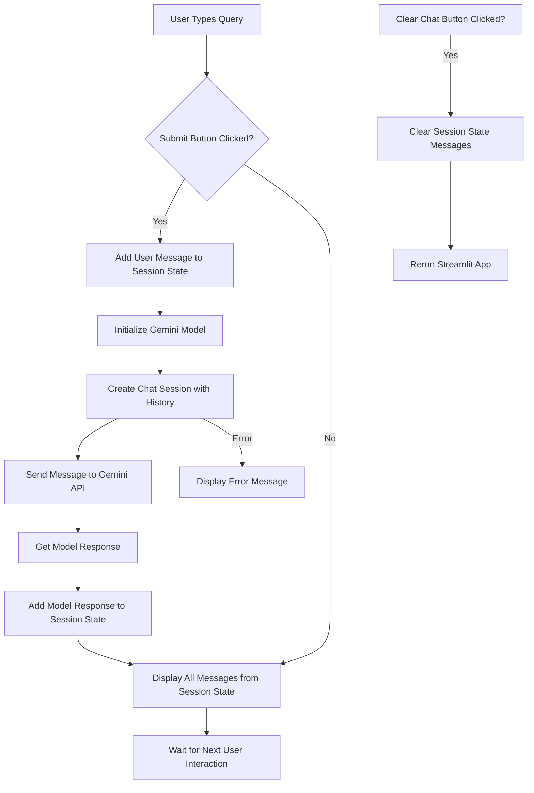

id: 6891027254d65e6ea0e3f008_documentation
summary: Lab 5.1 IRRBB Models - Development Documentation
feedback link: https://docs.google.com/forms/d/e/1FAIpQLSfWkOK-in_bMMoHSZfcIvAeO58PAH9wrDqcxnJABHaxiDqhSA/viewform?usp=sf_link
environments: Web
status: Published
# Building a Medical Chatbot with Streamlit and Google Gemini

## 1. Introduction and Project Setup
Duration: 0:05

Welcome to this codelab! In this guide, you will learn how to build a powerful **Medical Chatbot** using **Streamlit** for the user interface and **Google Gemini Pro** for the underlying conversational AI. This application will allow users to ask medical questions and receive relevant responses, showcasing the potential of large language models (LLMs) in healthcare.

The importance of AI in healthcare is rapidly growing, offering innovative solutions for diagnostics, treatment, and patient interaction. Generative AI, specifically, can revolutionize how information is accessed and processed in medical contexts. Google Gemini Pro stands out as a highly capable multi-modal model, suitable for various conversational tasks. Streamlit provides a fantastic framework for quickly building and deploying interactive data applications, making it perfect for demonstrating AI functionalities.

By the end of this codelab, you will have a working Medical Chatbot, understand how to integrate LLMs into a Streamlit application, manage conversational state, and handle API keys securely.

<aside class="positive">
<b>Why this is important:</b> This project combines modern web application development with cutting-edge AI, offering a practical example of how to leverage LLMs for real-world applications in a sensitive domain like healthcare.
</aside>

### Prerequisites

Before you begin, ensure you have the following:
*   Python 3.8+ installed on your system.
*   `pip` (Python package installer).
*   A Google Cloud account and an API key for Google Gemini. You can obtain a free API key from [Google AI Studio](https://aistudio.google.com/app/apikey) by creating a new project or selecting an existing one.

### Project Setup

Let's start by creating a new directory for our project and setting up the necessary files.

1.  Create a new directory named `medical_chatbot_codelab`:
    ```bash
    mkdir medical_chatbot_codelab
    cd medical_chatbot_codelab
    ```

2.  Create a `requirements.txt` file and add the required libraries:
    ```bash
    touch requirements.txt
    ```

3.  Open `requirements.txt` and add the following:
    ```
    streamlit
    google-generativeai
    ```

4.  Install the dependencies:
    ```bash
    pip install -r requirements.txt
    ```

5.  Create an empty Python file named `app.py`, which will contain our Streamlit application code:
    ```bash
    touch app.py
    ```

Your project directory should now look like this:
```
medical_chatbot_codelab/
├── app.py
└── requirements.txt
```

## 2. Basic Streamlit User Interface
Duration: 0:10

In this step, we'll lay the foundation of our chatbot's user interface using Streamlit. We'll add a title, a text input for user queries, and buttons to submit questions and clear the chat history.

Open `app.py` and add the following code:

```python
import streamlit as st

def main():
    st.set_page_config(page_title="Medical Chatbot", page_icon="⚕️")
    st.title("⚕️ Medical Chatbot")

    # Text input for user questions
    user_query = st.text_input("Ask your medical questions here...", key="user_input")

    # Buttons for actions
    col1, col2 = st.columns([1, 1])
    with col1:
        submit_button = st.button("Submit")
    with col2:
        clear_chat_button = st.button("Clear Chat")

    # Placeholder for chat display (will be implemented later)
    st.write("")
    st.write("Chat History will appear here.")

if __name__ == "__main__":
    main()
```

### Understanding the code:

*   `import streamlit as st`: Imports the Streamlit library.
*   `st.set_page_config`: Configures the browser tab's title and icon.
*   `st.title`: Displays the main title of the application.
*   `st.text_input`: Creates a text input field where users can type their questions. The `key` parameter ensures unique identification if you have multiple text inputs.
*   `st.columns`: Divides the layout into columns, allowing us to place buttons side-by-side.
*   `st.button`: Creates clickable buttons.

### Running the application:

Save `app.py` and run it from your terminal using:

```bash
streamlit run app.py
```

Your browser should open a new tab displaying a basic Streamlit application with the title, text input, and two buttons. You won't see any chat functionality yet, but the UI elements are in place.

## 3. Integrating Google Gemini API
Duration: 0:15

Now, let's connect our Streamlit app to the Google Gemini API. This involves configuring the API key and initializing the generative model.

### Obtaining your Gemini API Key

If you haven't already, go to [Google AI Studio](https://aistudio.google.com/app/apikey), log in with your Google account, and create an API key. Copy this key, as you'll need it.

### Securely Storing API Keys

For production deployments, Streamlit recommends using `st.secrets` to store sensitive information like API keys. However, for local development and to make the codelab more interactive, we'll allow users to input the API key via the sidebar (which we'll add in a later step). For now, we'll set it up to read from an environment variable or `st.secrets`.

Modify `app.py` to include Gemini API integration:

```python
import streamlit as st
import google.generativeai as genai
import os # Import os for environment variables

#  Google Gemini Configuration 
def configure_gemini():
    # Attempt to get API key from Streamlit secrets (for deployed apps)
    # or from environment variables (for local development)
    google_api_key = st.secrets.get("GOOGLE_API_KEY") or os.getenv("GOOGLE_API_KEY")

    if not google_api_key:
        st.warning("Google API Key not found. Please provide it in the sidebar.")
        return False
    
    try:
        genai.configure(api_key=google_api_key)
        return True
    except Exception as e:
        st.error(f"Error configuring Gemini API: {e}. Please check your API key.")
        return False

#  Main Application Logic 
def main():
    st.set_page_config(page_title="Medical Chatbot", page_icon="⚕️")
    st.title("⚕️ Medical Chatbot")

    # Check and configure Gemini API
    if not configure_gemini():
        # If API not configured, prevent further interaction
        st.stop() # Stop execution if API key is missing or invalid
    
    # Text input for user questions
    user_query = st.text_input("Ask your medical questions here...", key="user_input")

    # Buttons for actions
    col1, col2 = st.columns([1, 1])
    with col1:
        submit_button = st.button("Submit")
    with col2:
        clear_chat_button = st.button("Clear Chat")

    # Placeholder for chat display (will be implemented later)
    st.write("")
    st.write("Chat History will appear here.")

if __name__ == "__main__":
    main()
```

### Explanation of changes:

*   `import google.generativeai as genai`: Imports the Gemini SDK.
*   `import os`: Used to access environment variables.
*   `configure_gemini()` function:
    *   Tries to retrieve the API key from `st.secrets.GOOGLE_API_KEY` (if deployed on Streamlit Cloud with secrets configured) or from the `GOOGLE_API_KEY` environment variable.
    *   If no key is found, it displays a warning and returns `False`.
    *   If a key is found, it attempts to configure the `genai` library.
    *   It includes basic error handling for API key configuration.
*   `main()` function:
    *   Calls `configure_gemini()` at the beginning.
    *   If `configure_gemini()` returns `False` (meaning the API key is missing or invalid), `st.stop()` is called to halt the script, preventing errors from subsequent API calls.

To test this locally without setting up `st.secrets`, you can set an environment variable `GOOGLE_API_KEY` in your terminal before running the app:

```bash
export GOOGLE_API_KEY="YOUR_API_KEY_HERE"
streamlit run app.py
```
(On Windows, use `set GOOGLE_API_KEY="YOUR_API_KEY_HERE"`).

If the API key is not set, you should see a warning message at the top of your Streamlit application.

## 4. Managing Chat History with `st.session_state`
Duration: 0:15

Streamlit applications re-run their entire script from top to bottom every time a user interacts with them (e.g., clicking a button, entering text). To maintain the state of our application, such as chat messages, across these re-runs, we use `st.session_state`.

In this step, we'll implement the logic to store and display the conversation history.

Update `app.py` with the following:

```python
import streamlit as st
import google.generativeai as genai
import os

#  Google Gemini Configuration 
def configure_gemini(api_key=None): # Added api_key parameter
    google_api_key = api_key or st.secrets.get("GOOGLE_API_KEY") or os.getenv("GOOGLE_API_KEY")

    if not google_api_key:
        # We'll handle this warning in the sidebar later
        return False
    
    try:
        genai.configure(api_key=google_api_key)
        return True
    except Exception as e:
        st.error(f"Error configuring Gemini API: {e}. Please check your API key.")
        return False

#  Main Application Logic 
def main():
    st.set_page_config(page_title="Medical Chatbot", page_icon="⚕️")
    st.title("⚕️ Medical Chatbot")

    # Initialize chat history in session state
    if "messages" not in st.session_state:
        st.session_state.messages = []

    # Display existing messages
    for message in st.session_state.messages:
        with st.chat_message(message["role"]):
            st.markdown(message["content"])
    
    # Placeholder for API Key input (will be moved to sidebar)
    # api_key_input = st.text_input("Enter your Google API Key here:", type="password", key="api_key_input_main")
    
    # Configure Gemini with the provided key (or from secrets/env)
    # This logic will be moved to the sidebar later
    # if api_key_input:
    #     api_configured = configure_gemini(api_key_input)
    # else:
    #     api_configured = configure_gemini() # Try to configure from secrets/env
    
    # Simplified for now, will refine in next step
    api_configured = configure_gemini()


    # Text input for user questions
    user_query = st.text_input("Ask your medical questions here...", key="user_input")

    # Buttons for actions
    col1, col2 = st.columns([1, 1])
    with col1:
        submit_button = st.button("Submit")
    with col2:
        clear_chat_button = st.button("Clear Chat")

    # Chat logic will go here
    if api_configured and submit_button and user_query:
        st.write("Processing user query...") # Placeholder for now

    if clear_chat_button:
        st.session_state.messages = []
        st.rerun() # Rerun to clear displayed messages

if __name__ == "__main__":
    main()
```

### Understanding `st.session_state`:

*   `if "messages" not in st.session_state: st.session_state.messages = []`: This line checks if a list named `messages` exists in `st.session_state`. If not, it initializes an empty list. This ensures that `st.session_state.messages` is always available and persists across reruns.
*   `for message in st.session_state.messages:`: This loop iterates through all stored messages.
*   `with st.chat_message(message["role"]): st.markdown(message["content"])`: Streamlit provides `st.chat_message` to display messages with a distinct sender (e.g., "user" or "assistant") and styling. `st.markdown` renders the content, supporting Markdown formatting.
*   `if clear_chat_button: st.session_state.messages = []; st.rerun()`: When the "Clear Chat" button is clicked, we empty the `messages` list and then use `st.rerun()` to force Streamlit to re-execute the script, effectively clearing the displayed chat.

Now, if you run the app, nothing will appear in the chat history initially. After you type something and hit submit (which currently does nothing with the message), the "Clear Chat" button will work, resetting the (empty) history. This sets us up for the next step where we'll integrate the actual chat logic.

## 5. Implementing Chat Logic
Duration: 0:20

This is the core of our chatbot. We will implement the logic to send user queries to the Gemini API, get responses, and update the chat history. We'll also choose the Gemini Pro model.

### Chat Architecture Diagram

Here's a simplified flow of how the chatbot will work:



Update `app.py` again:

```python
import streamlit as st
import google.generativeai as genai
import os

#  Google Gemini Configuration 
def configure_gemini(api_key=None):
    google_api_key = api_key or st.secrets.get("GOOGLE_API_KEY") or os.getenv("GOOGLE_API_KEY")

    if not google_api_key:
        return False
    
    try:
        genai.configure(api_key=google_api_key)
        return True
    except Exception as e:
        st.error(f"Error configuring Gemini API: {e}. Please check your API key.")
        return False

# Function to get Gemini response
def get_gemini_response(chat_history, prompt):
    model = genai.GenerativeModel("gemini-pro")
    
    # Initialize chat session or continue existing one
    # Note: Gemini's `start_chat` expects history in a specific format
    # [{ 'role': 'user', 'parts': ['...',] }, {'role': 'model', 'parts': ['...',] }]
    # Our st.session_state.messages stores {'role': 'user'/'assistant', 'content': '...'}
    # We need to convert this for the API call.

    # Filter out empty messages and prepare history for Gemini
    gemini_history = []
    for msg in chat_history:
        if msg["content"].strip(): # Only include non-empty messages
            role = "user" if msg["role"] == "user" else "model"
            gemini_history.append({"role": role, "parts": [msg["content"]]})

    chat = model.start_chat(history=gemini_history)
    
    try:
        response = chat.send_message(prompt)
        return response.text
    except Exception as e:
        st.error(f"Error communicating with Gemini API: {e}")
        st.info("Please try again or check your API key and network connection.")
        return "An error occurred while getting a response from the AI."

#  Main Application Logic 
def main():
    st.set_page_config(page_title="Medical Chatbot", page_icon="⚕️")
    st.title("⚕️ Medical Chatbot")

    # Initialize chat history in session state
    if "messages" not in st.session_state:
        st.session_state.messages = []

    # Display existing messages
    for message in st.session_state.messages:
        with st.chat_message(message["role"]):
            st.markdown(message["content"])
    
    # Configure Gemini (for now, relies on env var/secrets)
    api_configured = configure_gemini()
    if not api_configured:
        st.warning("Please provide a valid Google API Key to use the chatbot.")
        # Optional: Disable input if API not configured
        # st.stop() # Removed st.stop() to allow API key input in sidebar later

    # Text input for user questions
    user_query = st.text_input("Ask your medical questions here...", key="user_input")

    # Buttons for actions
    col1, col2 = st.columns([1, 1])
    with col1:
        submit_button = st.button("Submit")
    with col2:
        clear_chat_button = st.button("Clear Chat")

    #  Chat Logic 
    if submit_button and user_query and api_configured:
        # Add user message to chat history
        st.session_state.messages.append({"role": "user", "content": user_query})
        
        # Display user message immediately
        with st.chat_message("user"):
            st.markdown(user_query)
        
        # Get Gemini response
        with st.spinner("Thinking..."): # Show a spinner while waiting for response
            model_response = get_gemini_response(st.session_state.messages, user_query)
        
        # Add model response to chat history
        st.session_state.messages.append({"role": "assistant", "content": model_response})
        
        # Display model response
        with st.chat_message("assistant"):
            st.markdown(model_response)

        # Clear the input field after submission (optional, for better UX)
        st.session_state.user_input = "" 
    
    #  Clear Chat Logic 
    if clear_chat_button:
        st.session_state.messages = []
        st.rerun() # Rerun to clear displayed messages

if __name__ == "__main__":
    main()
```

### Key Changes and Concepts:

*   **`get_gemini_response(chat_history, prompt)` function:**
    *   Initializes `genai.GenerativeModel("gemini-pro")`. This specifies that we want to use the Gemini Pro model.
    *   **Chat History Conversion**: The Gemini API expects conversation history in a specific format (e.g., `{'role': 'user', 'parts': [...]}`). We iterate through `st.session_state.messages` and convert it to match this format. `st.session_state.messages` stores `{'role': 'user'/'assistant', 'content': '...'}`.
    *   `chat = model.start_chat(history=gemini_history)`: This is crucial for multi-turn conversations. It initializes a chat session with the entire `gemini_history` up to that point, allowing the model to remember context.
    *   `response = chat.send_message(prompt)`: Sends the current user `prompt` within the context of the `chat` session.
    *   Includes basic error handling for API communication.
*   **Chat Logic in `main()`:**
    *   `if submit_button and user_query and api_configured:`: This condition ensures the logic only runs when the "Submit" button is clicked, there's a query, and the API is configured.
    *   **Add User Message:** `st.session_state.messages.append({"role": "user", "content": user_query})` adds the user's message to our session state.
    *   **Display User Message:** `with st.chat_message("user"): st.markdown(user_query)` immediately displays the user's message.
    *   **Spinner:** `with st.spinner("Thinking...")` provides visual feedback to the user while the API call is being made.
    *   **Get Model Response:** Calls `get_gemini_response` to interact with Gemini.
    *   **Add Model Response:** `st.session_state.messages.append({"role": "assistant", "content": model_response})` adds the AI's response to the session state.
    *   **Display Model Response:** `with st.chat_message("assistant"): st.markdown(model_response)` displays the AI's message.
    *   **Clear Input Field:** `st.session_state.user_input = ""` clears the text input field after submission, ready for the next query.
*   **`st.warning` update**: We changed `st.stop()` to `st.warning()` if API is not configured. This allows the app to load and for the user to input the API key later in the sidebar.

Run the application again:

```bash
streamlit run app.py
```

Now, if your `GOOGLE_API_KEY` environment variable is set correctly, you should be able to type medical questions and receive responses from the Gemini Pro model!

<aside class="negative">
<b>Important Note:</b> While Gemini Pro is powerful, it is a general-purpose language model. For critical medical applications, always consult with qualified healthcare professionals. This chatbot is for informational purposes and educational demonstrations only. Do not use it for diagnosing or treating medical conditions.
</aside>

## 6. Enhancing the User Interface (Sidebar and Model Selection)
Duration: 0:10

To make our application more user-friendly and flexible, we'll add a sidebar. The sidebar will contain:
*   An "About" section for context.
*   A dropdown to select different Gemini models (though we'll stick to 'gemini-pro' for this codelab, it demonstrates the capability).
*   An input field for the Google API Key, allowing users to configure it directly within the app.
*   Information about Gemini Pro's capabilities.

Let's modify `app.py` to incorporate the sidebar.

```python
import streamlit as st
import google.generativeai as genai
import os

#  Google Gemini Configuration 
def configure_gemini(api_key=None):
    google_api_key = api_key or st.secrets.get("GOOGLE_API_KEY") or os.getenv("GOOGLE_API_KEY")

    if not google_api_key:
        return False
    
    try:
        genai.configure(api_key=google_api_key)
        return True
    except Exception as e:
        st.error(f"Error configuring Gemini API: {e}. Please check your API key.")
        return False

# Function to get Gemini response
def get_gemini_response(chat_history, prompt, model_name="gemini-pro"):
    try:
        model = genai.GenerativeModel(model_name)
    except Exception as e:
        st.error(f"Error loading model '{model_name}': {e}. Please check model name and API key.")
        return "An error occurred while initializing the AI model."
    
    gemini_history = []
    for msg in chat_history:
        if msg["content"].strip():
            role = "user" if msg["role"] == "user" else "model"
            gemini_history.append({"role": role, "parts": [msg["content"]]})

    # Ensure chat history is not empty for start_chat
    if not gemini_history:
        # If history is empty, start a new chat without history
        chat = model.start_chat(history=[])
    else:
        chat = model.start_chat(history=gemini_history)
    
    try:
        response = chat.send_message(prompt)
        return response.text
    except Exception as e:
        st.error(f"Error communicating with Gemini API: {e}")
        st.info("Please try again or check your API key and network connection.")
        return "An error occurred while getting a response from the AI."

#  Main Application Logic 
def main():
    st.set_page_config(page_title="Medical Chatbot", page_icon="⚕️")
    st.title("⚕️ Medical Chatbot")

    #  Sidebar 
    with st.sidebar:
        st.header("About the Medical Chatbot")
        with st.expander("Learn More"):
            st.markdown(
                """
                This chatbot is powered by **Google Gemini Pro**, a large language model
                capable of understanding and generating human-like text. It's designed
                to answer general medical questions, provide health information, and
                explain medical concepts.

                <aside class="negative">
                <b>Disclaimer:</b> This AI chatbot is for informational purposes only and is not a substitute for professional medical advice, diagnosis, or treatment. Always seek the advice of your physician or other qualified health provider with any questions you may have regarding a medical condition.
                </aside>
                """
            )
        
        st.write("")
        st.header("Configuration")
        
        # API Key Input
        api_key_input = st.text_input(
            "Enter your Google API Key:",
            type="password",
            key="api_key_sidebar",
            value=st.session_state.get("google_api_key_configured", "") # Pre-fill if already configured
        )
        
        # Store API key in session state for persistence
        if api_key_input:
            st.session_state.google_api_key_configured = api_key_input
        
        api_configured = configure_gemini(api_key_input)

        if not api_configured:
            st.warning("Please provide a valid Google API Key to use the chatbot.")
            st.markdown("You can get your API key from [Google AI Studio](https://aistudio.google.com/app/apikey).")

        # Model Selection
        selected_model = st.selectbox(
            "Select a model:",
            options=["gemini-pro"], # Can add more models if available and relevant
            key="model_selector"
        )

        st.write("")
        with st.expander("Google Gemini Pro Capabilities"):
            st.markdown(
                """
                *   **Conversational AI:** Engages in natural, multi-turn conversations.
                *   **Information Retrieval:** Provides summaries, explanations, and answers based on its training data.
                *   **Reasoning:** Can perform logical reasoning to understand complex queries.
                *   **Multi-modal (limited here):** While Gemini Pro is multi-modal, this specific app focuses on text-based interactions.
                """
            )

    # Initialize chat history in session state
    if "messages" not in st.session_state:
        st.session_state.messages = []

    # Display existing messages
    for message in st.session_state.messages:
        with st.chat_message(message["role"]):
            st.markdown(message["content"])
    
    # Text input for user questions
    user_query = st.text_input("Ask your medical questions here...", key="user_input")

    # Buttons for actions
    col1, col2 = st.columns([1, 1])
    with col1:
        submit_button = st.button("Submit")
    with col2:
        clear_chat_button = st.button("Clear Chat")

    #  Chat Logic 
    if submit_button and user_query and api_configured:
        # Add user message to chat history
        st.session_state.messages.append({"role": "user", "content": user_query})
        
        # Display user message immediately
        with st.chat_message("user"):
            st.markdown(user_query)
        
        # Get Gemini response
        with st.spinner("Thinking..."):
            # Pass the selected model name to the response function
            model_response = get_gemini_response(st.session_state.messages, user_query, selected_model)
        
        # Add model response to chat history
        st.session_state.messages.append({"role": "assistant", "content": model_response})
        
        # Display model response
        with st.chat_message("assistant"):
            st.markdown(model_response)

        # Clear the input field after submission
        st.session_state.user_input = "" 
    
    #  Clear Chat Logic 
    if clear_chat_button:
        st.session_state.messages = []
        st.rerun()

if __name__ == "__main__":
    main()
```

### New Streamlit Features:

*   **`with st.sidebar:`**: All content inside this `with` block will be rendered in the Streamlit sidebar.
*   **`st.header`**: Used for sub-headings within the sidebar.
*   **`st.expander`**: Creates an expandable/collapsible section, useful for hiding detailed information until needed (e.g., "Learn More", "Capabilities").
*   **`st.selectbox`**: Creates a dropdown menu. We use it for `selected_model`. The selected value is passed to `get_gemini_response`.
*   **API Key `st.text_input` in Sidebar**: We moved the API key input here.
    *   `type="password"` masks the input for security.
    *   `key="api_key_sidebar"`: Unique key for this input.
    *   `value=st.session_state.get("google_api_key_configured", "")`: This clever trick ensures that if the user has already entered an API key and it's stored in `st.session_state`, it will pre-fill the input field on subsequent reruns, preventing them from having to re-enter it constantly.
    *   `st.session_state.google_api_key_configured = api_key_input`: This line saves the entered API key into `st.session_state` so it persists.

### Running the Enhanced Application:

Run the app again:

```bash
streamlit run app.py
```

You will now see a sidebar on the left. You can enter your Google API key directly in the sidebar, which will then configure the Gemini model. Test the "Clear Chat" and observe the API key input persistence.

## 7. Running and Extending the Application
Duration: 0:05

Congratulations! You have successfully built a functional Medical Chatbot using Streamlit and Google Gemini Pro.

### Final Review of the Application

Let's summarize what we've built:

*   A user-friendly web interface for a chatbot using Streamlit.
*   Integration with the Google Gemini Pro API for powerful conversational AI.
*   Management of chat history using `st.session_state` for multi-turn conversations.
*   Dynamic API key input and model selection through a Streamlit sidebar.
*   Basic error handling for API communication.

Your final `app.py` should look like the one in the previous step.

### How to Run

To run your complete Medical Chatbot:

1.  Navigate to your project directory in the terminal:
    ```bash
    cd medical_chatbot_codelab
    ```
2.  Ensure you have all dependencies installed:
    ```bash
    pip install -r requirements.txt
    ```
3.  Run the Streamlit application:
    ```bash
    streamlit run app.py
    ```
4.  Open your browser to the local URL provided by Streamlit (usually `http://localhost:8501`).
5.  Enter your Google API Key in the sidebar if it's not already pre-filled or configured via environment variables.
6.  Start asking medical questions in the main chat interface!

### Potential Extensions and Improvements

This chatbot provides a solid foundation. Here are some ideas for further enhancements:

*   **Robust Error Handling**: Implement more specific error handling for different Gemini API responses (e.g., rate limits, content safety filters).
*   **Streaming Responses**: Gemini API supports streaming responses. You could implement this to display AI's response word-by-word, improving perceived performance.
*   **Prompt Engineering for Medical Context**: Fine-tune the system prompt or user query prompts to encourage the model to act specifically as a "medical assistant," emphasizing safety, disclaimers, and accuracy.
*   **Retrieval-Augmented Generation (RAG)**: Integrate a knowledge base of verified medical information. Instead of relying solely on the LLM's training data, you could retrieve relevant articles or guidelines and then provide them to the LLM as context for generating more accurate and up-to-date medical answers. This is critical for real-world medical applications.
*   **User Authentication**: For a production application, implement user login and management.
*   **Deployment**: Deploy your Streamlit application to Streamlit Cloud, Hugging Face Spaces, or your own cloud provider (AWS, GCP, Azure).
*   **Safety and Moderation**: Implement content moderation (e.g., using Google's Content Safety API or other tools) to prevent the generation of harmful or inappropriate medical advice.
*   **Feedback Mechanism**: Add a way for users to provide feedback on the AI's responses (e.g., "Helpful / Not Helpful" buttons).

You can download the final code for this codelab here:
<button>
  [Download Final Code](https://github.com/your-repo/medical_chatbot_codelab/archive/main.zip)
</button>
(Note: This is a placeholder link. Replace with your actual GitHub repository or a download link if you host the code.)

<aside class="positive">
<b>Keep Learning:</b> Experiment with different prompts, explore other features of the `google-generativeai` library, and consider how you could apply these concepts to other domains!
</aside>
